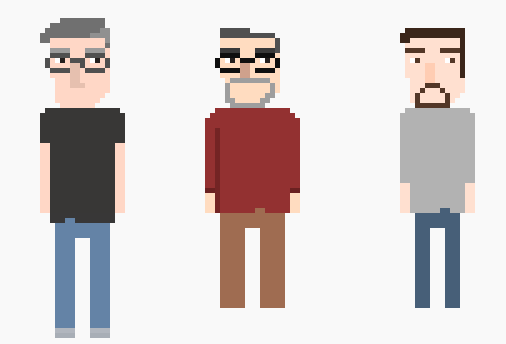

# Navigation Structure
{: .no_toc }

## Table of contents
{: .no_toc .text-delta }

1. TOC
{:toc}

---

# Advice

This page contains some advice and tips from myself for developers looking to expand upon this game in a creative direction
of their choice.

## How to start working on this game

In the workplace, a majority of the time you will find yourself being put to work on an existing project where you don't
understand what it is doing, how the code works, or sometimes what the goal of the project even is. It is normal to feel
overwhelmed when this happens. I used to get really anxious during times like these (and sometimes still do), but truthfully
there is nothing to be anxious about. You can only do as much as you can, and coding is really hard, so my advice for you to
start working on this game is to just take things slow. 

Start by playing around with the code and changing minor things. Running the game and seeing your changes in action
will help you identify and confirm where different pieces of code logic is located. Maybe head over to the `Cat` class and
change its `jumpHeight` instance variable, or play around in the map editor. Just get a feel for the project and what you're
going to be working with. Also, don't be afraid to consult your peers, google, or this site for answers to your questions.

For your first couple tasks you should pick up something on the small side. No reason to dive head first into things before
you understand how anything works. Whenever I am placed on a new project at work, I always look at the list of upcoming tasks
and take one or two easier ones (usually bug fixes) that will give me a chance to get a feel for how the project is laid out. Once
the initial "training" tasks are completed, take on a bigger one if you feel comfortable. Sometimes tasks that you think will take
an hour will take multiple days; that's just the way programming is. :man_shrugging: :woman_shrugging:

Understanding how the game loop's `update` and `draw` cycles work is the key to success!

## Copy and paste and the art of a template

If you are creating something, such as a new enemy, you (almost) always have a starting point: existing code!
Using something else as a template is the key to working within an already defined logic flow. Most of the code written for this game
is "setting up" resources, and there's no need to reinvent the wheel if you don't have to. Go ahead and find an existing class that
has similar functionality to the thing you want to create, copy and paste the entire thing, and then start modifying values/adding code
as you see fit. You also have a perfectly working "clone" of the old class at first, so it will be set up and able to be tested in game
right away. 

While developing this program, I continually copy and pasted my own code to get things setup correctly. There's no need to memorize
things like that when the answers are all available to you -- use that saved brain space for memorizing more song lyrics!

## Identify classes you will need to work with for a specific task

There are tons of classes in this game (most game codebases are pretty large and complex), but you will find that
for each task you will rarely come into contact with more than two or three of them at a time. Identifying which classes you don't
have to touch for a specific task lets you really narrow down your focus to a much smaller unit of code.

Once you have decided on a task to work on (whether it be adding a new feature, updating an existing feature, or fixing a bug),
take a few minutes to identify where in the project (which files/methods) will need to be modified/worked with in order to successfully
complete the task. While this may take a longer time at first, having a plan will make the task feel less daunting, give you
a place to at least start from, and also makes it easier for others to help you if you have some sort of "logical reasoning" that you
can explain to them for how you got to the point where you ended up stuck. Once you get more comfortable with the codebase,
this pre-planning step will take far less time to do, to the point where you'll probably just dive right into the code and ask questions
later.

## Art

As a developer that has never attempted to make my own game art before creating this game, I have to say it was a lot of fun (even
though it's not very good). I recommend that everyone give a shot at creating some game art, even if it's just editing the colors
on existing sprites. While the logic that goes into running the game is extremely important for obvious reasons, the visuals of a game are also very important
as they are the "output" to the user of the program, and it never hurts to get involved a bit with the other side of things.

With that said, the [spriters resource](https://www.spriters-resource.com/) is an amazing website full of graphics from
any game on any console that you can think of. It also has a companion site [sounds resource](https://www.sounds-resource.com/) for looking up music/sound files
(something that this game desperately needs).

## Have fun

Making a game is fun, so have fun! Be creative. There's no "right" or "wrong" way for you to expand upon this game, just choose a direction
that you will enjoy working on. I remember when I took this class back when I was a student at Quinnipiac, my team added Professors Hoffman,
Blake, and Duncan as enemies into the game because it was hilarious, and we ended up having a lot of fun just making each other laugh
while improving our overall coding skills. 

These were the professor graphics in case you were wondering (I miraculously found them on my old google drive account).

