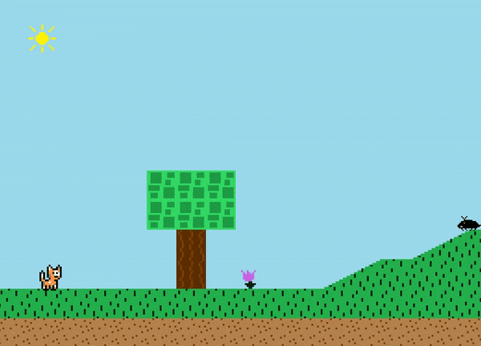
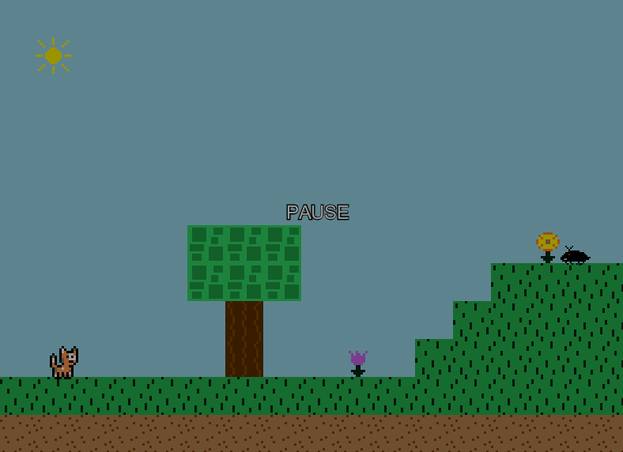
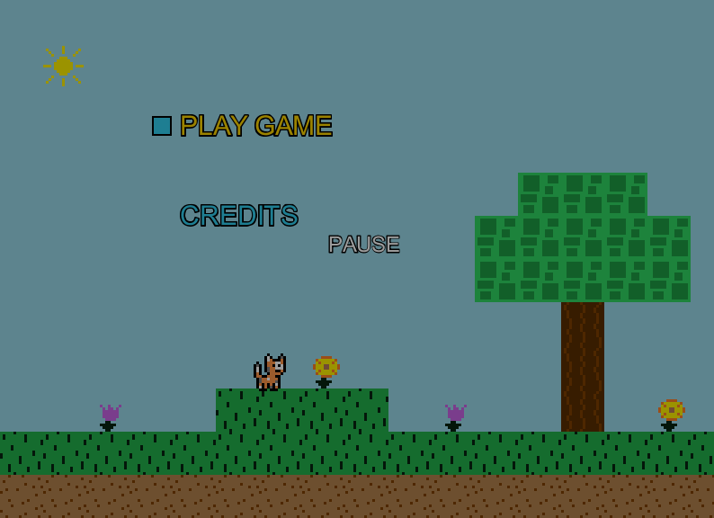

## Table of contents
{: .no_toc .text-delta }

1. TOC
{:toc}

---

# Bug Report

Below is a list of known bugs and oddities in the game code.
There are definitely more bugs than what is listed here...they just haven't been discovered yet.

## Map boundaries have no collisions

The player can walk off the edge of the map and will fall to their death with no way of getting back into the level.

It's hard to tell in the above gif, but after running offscreen over the edge of the last tile in the map, there is no collision
stopping the player from continuing onward into the empty void.

A possible solution for this is to block the edge of every map with solid tiles, but this would look really ugly and is a band-aid rather than a fix. 
A better solution would be to prevent the player from actually moving off the edge, as if there is an invisible collision wall there. 
It could be as simple as preventing the player's x location from being less than 0, and preventing the player's x2 location from being greater than the map's length in pixels.

## Pausing the game works from any screen

When the P key is pressed anywhere in the game, the game's `update` cycle will stop, which essentially halts the game.
Pressing the P key again while the game is paused will unpause the game and the `update` cycle will continue right where it left off. 
When the game is paused, a large "PAUSE" text will appear at the center of the screen, and the background of the screen will be tinted.

The pause game logic is included in the game engine's `GamePanel` class, which is the root of the game loop. This means
that it is active while any screen is loaded, including things like menu screen...which is definitely not ideal.

This is good.

This is not good.

The reason for this is that I originally made a simple version of this game engine that I later built off of to create this game engine (which can be found [here](https://github.com/a-r-t/Simple-2D-Game-Engine) that essentially had only one screen, so having the pause functionality be in that "global" space made sense. 
I never fixed it as I scaled the engine up, which is why the pause functionality now works everywhere.

I think the best course of action is moving the pause logic from the `GamePanel` over to something like the `PlayLevelScreen` which handles the running of the actual level. 

## Moving the player with arrow keys doesn't override previous key press properly

If you are holding the key to move the player to the right and then press left while holding the right key down still,
the left key overrides the right key and moves the player left. 
However, if holding the key to move the player to the left and then press the right while holding the left key down still, the let key does not override the right key and player will continue moving left. 
This is inconsistent. 
For a more natural feel in a game that moves a player with keyboard input,
it's generally best to have both keys able to continually override each other.

This is not an arrow key specific thing -- this happens because of the order in which the if statement is checking which key is currently being pressed.
Solving this will require updating the player walking logic to allow the movement keys to override one another.

## JFrame size inconsistency between Windows and MacOS

On MacOS, the JFrame size is slightly larger than it is on Windows.
Might have to do with how the frame style changes across the different operating systems, but I am not 100% sure...