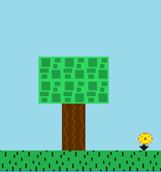

# Navigation Structure
{: .no_toc }

## Table of contents
{: .no_toc .text-delta }

1. TOC
{:toc}

---

# Loading Images

## Reading images into the game

The engine's `ImageLoader` class has methods that will read an image into the game into Java's `BufferedImage` data type.

The Image Loader provides two methods:
- **load** -- reads an image into the game
- **loadSubImage** -- reads a piece of an image into the game

Pass the method an image file and it will read it in, no questions asked.

## Resources Directory

The `ImageLoader` class will look for image files relative to the directory defined as the `RESOURCES_PATH`,
which is set in the `Config` class. By default, it is set to a `Resources/` directory at the root of the project.
If an image is placed in that `Resources/` directory named "cat.png", the file name can be supplied directly
to the `ImageLoader` methods.

```java
BufferedImage catImage = ImageLoader.load("cat.png");
```

It is fine to add subfolders to the `Resource` directory, just be sure to include that in the path to the image.
For example, if there was a folder named `CatPics` inside the `Resources` folder, the path would look like this:

```java
BufferedImage catImage = ImageLoader.load("CatPics/cat.png");
```

### Changing resources directory

You are free to change the value of the `RESOURCE_PATH` variable in the `Config` class to change the location
of the folder that the `ImageLoader` will look for images in. It is not advisable to remove this restriction as a game
generally needs to guarantee that all of its assets are where they should be in order to run properly, and keeping them in one
base location limits room for error.

## Image Transparency

The "transparent" color of an image is a particular color in an image that is desired to be "invisible", meaning it will not be included
when the image is loaded into the game. Every sprite in the base game uses the color magenta (RGB 255 0 255) as its transparent color,
as that color is ugly and very rarely, if ever, used by any image. This magenta color is set as the default transparent color by
the `TRANSPARENT_COLOR` variable in the `Config` class.

For example, the following cat image used in game has its background set as magenta:


When loading this image into the game, the transparent color of magenta is set, meaning in game, the magenta color will not be shown:



Before you ask "why can't you just use a tool like photoshop to add a transparency to an image", the answer is that it is not advisable to do this
for games because it bloats the file size (leading to longer load times), takes additional time, and does not always work out as expected (especially with Java's limited image loading capabilities).

If you have an image file that requires a different transparent color, the `ImageLoader` class has alternate methods
to allow for a transparent color to be specified instead of just using the default one.

```java
// sets transparent color to blue
BufferedImage catImage = ImageLoader.load("cat.png", Color.blue);
```

### Changing default transparent color

A new color can be set as the default transparent color by changing the `TRANSPARENT_COLOR` variable in the `Config` class.