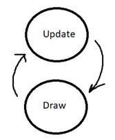

# Engine Package Documentation

## What is the Engine Package for?

The Engine Package contains the code for creating the game loop, setting up some "core" engine resources such as key detection a GUI.<br>
This engine is pretty basic and not made "specifically" for any one type of game,<br>
it just sets up the necessities in order to get a game going in Java.

## How does the engine work?
The engine is inspired by XNA, Microsoft’s old game programming framework that they supported for
anyone to use to write games for the Xbox360. Now it has been released open source as Monogame
since Microsoft discontinued support for it, and now a lot of other engines are based off of it.
The Game.java class contains the main method. Running the program will bring up a blank JFrame
window. A game loop starts running immediately that will continually cycle through update and draw
calls (update is where game logic takes place, draw is where rendering happens – what you show on
screen). That’s it! Below is a diagram that summarizes the entire game engine nicely:



As the user of this game engine, you will be creating game objects with their own update and draw
implementations to work with the engine.
This engine is built off of Java Swing components, mainly one JPanel which is where all renders are
drawn to. You don’t really have to touch these components though as the engine abstracts that away
from you.

## How to set up a game using this Engine?
Assuming a separate driver class is created, setting up the game loop and engine resources is pretty simple.

Upon instantiation of the `GameWindow` class, the game engine will set itself up.<br>
```java
GameWindow gameWindow = new GameWindow();
```

The game loop will start once the window's `startGame` method is called:
```java
gameWindow.startGame();
```

From there, the engine's `ScreenManager` class will load up the `DefaultScreen`, which does nothing.<br>
A `Screen` is a piece of the game that has its own update and draw cycles.<br>
For example, a game may have a "MenuScreen" or "PlayGameScreen".<br>
Any class that extends from the engine's `Screen` base class can be given to the `ScreenManager`.

To attach a Screen to the ScreenManager, grab the `ScreenManager` class instance from the `GameWindow` and then set its current screen to the desired Screen class: 
```java
public class MyScreen extends Screen {
    	@Override
    	public void initialize() {

    	}

        @Override
        public void update(Keyboard keyboard) {
    	    
    	}

        @Override
        public void draw(GraphicsHandler graphicsHandler) {
    	    
        }
}
```

```java
ScreenManager screenManager = gameWindow.getScreenManager();
screenManager.setCurrentScreen(new MyScreen());
```

From this point, the `MyScreen` class needs to implement the `initialize`, `update`, and `draw` methods to provide actual game logic and graphics.
As mentioned before, the engine itself is very simple, and just provides the basics -- it is up to the game maker to use the tools in the engine to actually create a playable game!

