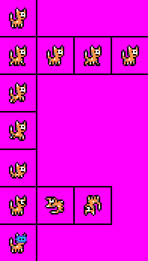
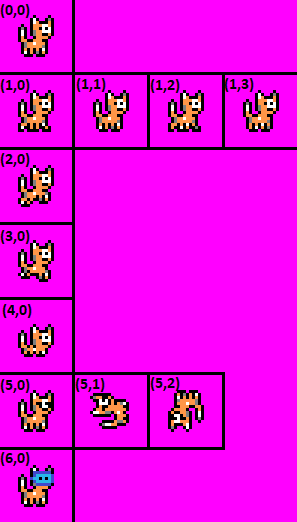

## Table of contents
{: .no_toc .text-delta }

1. TOC
{:toc}

---

# Game Object With Animations

Every `GameObject` subclass automatically has support for animations. 
An animation is an array of `Frame` class data.
Different graphics for each frame should come from a sprite sheet image file. 
It is recommend that if you are creating a new `GameObject` with animations, a new class that extends from `GameObject` should be created to separate out the animation data.

## Sprite Sheet

The `SpriteSheet` class is used to define a sprite sheet that the `AnimatedSprite` class uses for loading animation graphics.
A sprite sheet is one image file that contains multiple graphics (frames images) for a sprite. 
For example, below is the sprite sheet image file `Cat.png` which is used for the cat player character:



Each sprite image on the sprite sheet must be the same size, and each image must have one pixel in between it and another image that would come next to or below it. 
While not technically required, I drew black squares around each image, which both adds the one pixel buffer between each image and keeps the sprite sheet organized.
For the cat sprite sheet above, each sprite is 24x24 pixels, and animations for each sprite are laid out horizontally.
This is not a requirement -- images on a sprite sheet can be placed anywhere -- but I find it easier to manage animations by organizing them like this.

From here, a `SpriteSheet` class instance can be created, which will be passed into the `GameObject` class to be used to set up animations.
Here is an example of creating a `SpriteSheet` instance that the `Cat` class uses with the above cat sprite sheet image:

```java
new SpriteSheet(ImageLoader.load("Cat.png"), 24, 24)
```

The 24x24 is the size of each sprite in the sheet (width and height).

## Defining animations in a `GameObject` subclass

Any class that extends `GameObject` can override `GameObject's` `loadAnimations` method, which will load defined animations into the class upon initialization.
The signature and setup to override this method looks like this:


```java
@Override
public HashMap<String, Frame[]> loadAnimations(SpriteSheet spriteSheet) {
    return new HashMap<String, Frame[]>() {{
        
    }};
}
```


The `AnimatedSprite` class keeps track of animations with a `HashMap` that maps the name of an animation (String) to an array of `Frame` data.
Each animation can be thought of as an array of sprites with their own information like graphics, bounding collision rectangle, etc. 
In this `loadAnimations` method, animations can easily be added directly to this `HashMap` through the use of the earlier defined `SpriteSheet`. 

Since every image in a sprite sheet must be the same size, the `SpriteSheet` class is able to provide a `getSprite` method that will grab a particular graphic from the sheet based on row and column index. 
For example, in the above cat sprite sheet image, sprite index (0, 0) would be the standing cat in the top left corner.
Sprite indexes (1, 0), (1, 1), (1, 2), and (1, 3) would equate to each of the cat walking images.



### One frame animation

Using this `getSprite` method from the `SpriteSheet` class, it makes defining each animation easy. 
Below is an example from the `Cat` class where it defines a one frame animation of the cat standing still. 
There are two separate versions of this animation defined: a stand right animation, and a stand left animation. 
For the stand left animation, an image effect is added which will flip the image horizontally when the game loads it in:


```java
@Override
public HashMap<String, Frame[]> loadAnimations(SpriteSheet spriteSheet) {
    return new HashMap<String, Frame[]>() {{
    
        // adds STAND_RIGHT animation
        put("STAND_RIGHT", new Frame[] {
                new FrameBuilder(spriteSheet.getSprite(0, 0))
                        .withScale(3)
                        .withBounds(8, 9, 8, 9)
                        .build()
        });
    
        // adds STAND_LEFT animation
        put("STAND_LEFT", new Frame[] {
                new FrameBuilder(spriteSheet.getSprite(0, 0))
                        .withScale(3)
                        .withImageEffect(ImageEffect.FLIP_HORIZONTAL)
                        .withBounds(8, 9, 8, 9)
                        .build()
        });
    }};
}
```


This uses the [builder pattern](../game-patterns.md#builder-pattern) with the `FrameBuilder` class to build a `Frame` object instance.
The animations are put into the `HashMap` by first specifying a String for the animation's name (e.g. "STAND_RIGHT" and "STAND_LEFT") for the key and then providing the `Frame` array as the value.

Notice that both standing animations specify the sprite sheet image index of (0, 0) (cat at top left corner standing still),
and then several attributes are set such as `scale`, `imageEffect`, and `bounds`. 
These are all optional parameters and have default values if not specified here. 
For example, if no `withScale` is specified, the image by default will not be scaled from its original size.

### Animations with multiple frames

Many animations have multiple frames, such as in the above cat sprite sheet  where there are four frames for the cat walking. 
The same method for adding one frame animations also works for multiple frame animations, just instead of only including one `Frame` in the array, multiple `Frames` will be added.

Below is an example from the `Cat` class where it defines the "WALK_RIGHT" animation, which has four frames. 
The image indexes for these frames in the sprite sheet are (1,0), (1,1), (1,2), and (1,3).


```java
@Override
public HashMap<String, Frame[]> loadAnimations(SpriteSheet spriteSheet) {
    return new HashMap<String, Frame[]>() {{
    
        // add WALK_RIGHT animation
        put("WALK_RIGHT", new Frame[] {
            new FrameBuilder(spriteSheet.getSprite(1, 0), 14)
                    .withScale(3)
                    .withBounds(8, 9, 8, 9)
                    .build(),
            new FrameBuilder(spriteSheet.getSprite(1, 1), 14)
                    .withScale(3)
                    .withBounds(8, 9, 8, 9)
                    .build(),
            new FrameBuilder(spriteSheet.getSprite(1, 2), 14)
                    .withScale(3)
                    .withBounds(8, 9, 8, 9)
                    .build(),
            new FrameBuilder(spriteSheet.getSprite(1, 3), 14)
                    .withScale(3)
                    .withBounds(8, 9, 8, 9)
                    .build()
        });

    }};
}
```


That's it! 
A `Frame` array is used, and multiple `FrameBuilders` are then used to build each `Frame`. 
Notice there is an additional `delay` parameter added for each `Frame`, which here are set to 14.
This means that if "WALK_RIGHT" is the current animation, every 14 frames (game loop iterations) the game will change the current frame to the next frame in the array. 
Once the last frame is reached and completed, it will wrap back around to the first. 
The result in game would look like this:


Any number of `Frames` can be added to an animation, and any number of animations can be added to a `GameObject`. 
The delay value can be different for each frame to change frame transition times.

Also, putting a delay value of `-1` will prevent a frame from automatically transitioning to the next frame, so this can be useful to place in the last frame of an animation to prevent the animation from looping.

## Changing a Game Object's current animation while the game is running

It is common to want to change a `GameObject's` current animation (and as a result current frame) that is shown while the game is running.
For example, with the player character `Cat`, the animation should change from "STAND_RIGHT" to "WALK_RIGHT" when the right key is pressed.
The `AnimatedSprite` class provides several instance variables that can be used to manipulate animation/frame data:

- **currentAnimationName** -- the current animation that is being used, changing this to a new animation name will switch to that new animation
- **currentFrameIndex** -- the current frame index of an animation
- **hasAnimationLooped** -- will be true if an animation has looped at least one time (transitioned from the last frame index back to the first frame)

For example, in the `Player` class's `update` logic for when the player is standing and an arrow key is pressed, it will change the player's state to "WALKING".

```java
// ...

// if walk left, right, up, or down key is pressed, player enters WALKING state
if (Keyboard.isKeyDown(MOVE_LEFT_KEY) || Keyboard.isKeyDown(MOVE_RIGHT_KEY)) {
    playerState = PlayerState.WALKING;
}

// ...
```

Later, the code will detect the player's state has changed, and update its `currentAnimationName` to "WALK_RIGHT".

```java
// ...
else if (playerState == PlayerState.WALKING) {
    // sets animation to a WALK animation based on which way player is facing
    this.currentAnimationName = facingDirection == Direction.RIGHT ? "WALK_RIGHT" : "WALK_LEFT";
}
// ...
```

Lastly, the `update` logic at some point must make a call out to the base class's method in order for the `AnimatedSprite` class to run the required animation logic.
Otherwise, a `GameObject` will never be able to switch animations or transition between animation frames. 
Typically, this call should be made at the end of the subclass's `update` method.

```java
public void update(Player player) {
    // ... gameobject's update logic here

    // runs animation logic
    super.update();
}
```