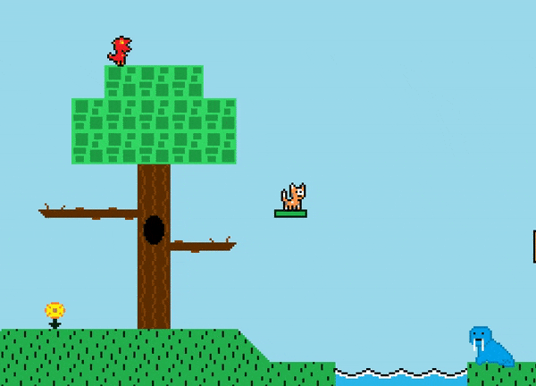

## Table of contents
{: .no_toc .text-delta }

1. TOC
{:toc}

---

# Enhanced Map Tiles

## What is an enhanced map tile?

An enhanced map tile (represented by the `EnhancedMapTile` class in the `Level` package) is a `MapEntity` subclass. 
The idea behind this class is that it acts just like a `MapTile` does in every way, but with the ability to define its own `update` and `draw` logic instead of just going with the `MapTile's` default logic. 
This allows a map tile to essentially do whatever it wants while still being counted as a map tile, meaning the `Player` will still consider it during its collision checks based on the `EnhancedMapTile's` tile type. 
Like every `MapEntity` subclass, an `EnhancedMapTile` during its `update` cycle will be given a reference to the `Player` instance, so it is able to interact with the player directly.

And yes, I know the name "enhanced map tile" is dumb, I couldn't think of a better name to describe these at the time and now I'm over it.

## Enhanced Map Tile Subclass

In the `EnhancedMapTiles` package, there is currently two subclasses of the `EnhancedMapTile` class -- `HorizontalMovingPlatform` and `EndLevelBox`.
Both classes define an enhanced map tile in the game, which can be seen in the `TestMap` map.

## Adding a new enhanced map tile to the game

This is simple -- create a new class in the `EnhancedMapTiles` package, subclass the `EnhancedMapTile` class, and then just implement desired logic from there. 
I recommend copying an existing enhanced map tile class as a "template" of sorts to help set up and design the enhanced map tile.

## Adding an enhanced map tile to a map

In a map subclass's `loadEnhancedMapTiles` method, enhanced map tiles can be defined and added to the map's enhanced map tile list. 
For example, in `TestMap`, both a `HorizontalMovingPlatform` and `EndLevelBox` are created and added to the enhanced map tile list:

```java
@Override
public ArrayList<EnhancedMapTile> loadEnhancedMapTiles() {
ArrayList<EnhancedMapTile> enhancedMapTiles = new ArrayList<>();
    HorizontalMovingPlatform hmp = new HorizontalMovingPlatform(
            ImageLoader.load("GreenPlatform.png"),
            getMapTile(24, 6).getLocation(),
            getMapTile(27, 6).getLocation(),
            TileType.JUMP_THROUGH_PLATFORM,
            3,
            new Rectangle(0, 6,16,4),
            Direction.RIGHT
    );
    enhancedMapTiles.add(hmp);

    EndLevelBox endLevelBox = new EndLevelBox(getMapTile(32, 7).getLocation());
    enhancedMapTiles.add(endLevelBox);

    return enhancedMapTiles;
}
```

## Enhanced map tiles currently in game

### Horizontal Moving Platform


This enhanced map tile is defined by the `HorizontalMovingPlatform` class.
It represents a platform that moves horizontally back and forth. 
The class is designed to allow any image to be used as the platform. 
The level currently uses the above simple green platform image.

For this class, two locations are given to its constructor, and the platform will just continually move back and forth between those two points. 
The platform in game is set to a tile type of `JUMP_THROUGH_PLATFORM` which allows the player to stand on it but also allows the player to jump through it from below.

If the player is standing on the platform, the `HorizontalMovingPlatform` class will perform special logic in its `update` method that will adjust
the player's x position to move along with the platform.



Also, if the platform's tile type is changed to `NOT_PASSABLE`, it will push the player if the player is in the way of it while it moves.

The image file for the green platform is `GreenPlatform.png`.

### End Level Box


This enhanced map tile is defined by the `EndLevelBox` class. 
Its job is simple: upon being touched by the player, it will set the player's "level state" to `LEVEL_COMPLETED`. This tells the player to do its win animation and whatever else may follow the level being completed.

```java
if (intersects(player)) {
    player.setLevelState(LevelState.LEVEL_COMPLETED);
}
```

The image file for the end level box is `GoldBox.png`.
