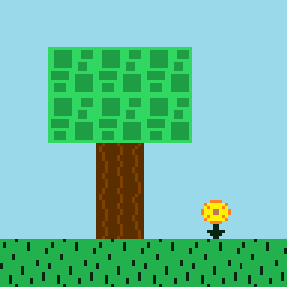
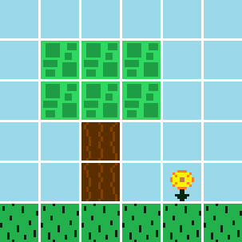
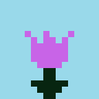
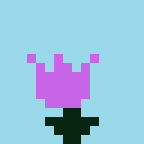
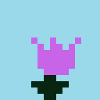

# Navigation Structure
{: .no_toc }

## Table of contents
{: .no_toc .text-delta }

1. TOC
{:toc}

---

# Map Tiles and Tilesets

## Map Tiles

In order to understand how the [map file](./map-file.md) is structured/read in, the concept of a "map tile" must be understood first.

Think of a map as a 2D grid. Each spot on the grid contains what is known as a "tile", which can be thought of as a smaller graphic
that fits right into the grid. A map is made up by joining these tile graphics together to create one large graphic representing the entire map.
For example, take a look at the below screenshot of a piece of a level:



This image is actually made up of individual tiles, such as the grass tile and the sky tile:


So the image seen above of the grass, tree, flower and sky is actually composed together by smaller individual tiles, which is known as a tile map:



Tiles make it very easy to build up a 2D map. The Map Editor makes this process of using tiles very obvious since the editor
allows tiles to be placed down on a grid in a desired location of the map. Each tile will have a specified index in the map at an x and y
location, e.g. the first tile in the top left corner would have an index of (0,0), the tile to the right of it would be (1,0) and the tile below it
would be (0,1).

The class `MapTile` in the `Level` package represents a map tile, which is really just a standard sprite with an attribute
for `TileType`, which determines how the tile is treated by the game -- for example, a tile type of `NOT_PASSABLE` means
that the `Player` cannot walk or fall through the tile, which is used on tiles like grass in order to have the player walk on it.
The available tile types are included in the `TileType` enum in the `Level` package. 

## Map Tileset

A tileset is a collection of map tiles. Easy enough.

Graphic wise, a tileset defines each tile in one image. Below is the `CommonTileset.png` which the (only) level in the game uses
to construct its map. You will notice that it's literally one image with each map tile defined. Note that each map tile in a tileset
must be the SAME width and height.


The `Tileset` class in the `Level` package represents a tileset, which contains a collection of `MapTile` object. The way to define
a tileset in this game is to create a class that extends from this `Tileset` class, such as the `CommonTileset` class in the `Tilesets` package.
From there, the extended `Tileset` class (such as `CommonTileset`) must call its super class with the following:
- The tileset image file to be used -- `CommonTileset` uses the `CommonTileset.png` file shown above
- The width and height for every tile in the tileset -- `CommonTileset` specifies that each tile graphic in the above image is 16x16
- The tileset scale, which is how much each tile in the tileset should be scaled by when drawn to the screen -- `CommonTileset` specifies a scale of 3, meaning each tile will be 48x48 pixels on screen

Additionally, the `Tileset` class method `defineTiles` must be overridden and have actual defined `MapTiles` added to it.

### Adding a map tile to a tileset

The setup for overriding the `defineTiles` method in a `Tileset` subclass looks like this:

```java
@Override
public ArrayList<MapTileBuilder> defineTiles() {
    ArrayList<MapTileBuilder> mapTiles = new ArrayList<>();
    return mapTiles;
}
```

From here, `MapTiles` can be added to the `ArrayList` -- kind of. This method actually defines a type of `MapTileBuilder`.
The general idea is that the class `MapTileBuilder`, which can be found in the `Builders`
package, essentially defines a `MapTile` but does not instantiate it yet. It's not too important to fully understand if you are unfamiliar with
the builder pattern (you can read more about it [here](../game-patterns.md#builder-pattern)), ideally you can use the `CommonTileset` class as a reference to guide you
in adding a new `MapTile` to a tileset.

The following example in the `defineTiles` method adds the grass tile to the tileset, which is the first graphic
in the top left corner of the above shown `CommonTileset.png` file:


```java
@Override
public ArrayList<MapTileBuilder> defineTiles() {
    ArrayList<MapTileBuilder> mapTiles = new ArrayList<>();

    // grass
    Frame grassFrame = new FrameBuilder(getSubImage(0, 0), 0)
            .withScale(tileScale)
            .build();

    MapTileBuilder grassTile = new MapTileBuilder(grassFrame)
            .withTileType(TileType.NOT_PASSABLE);

    mapTiles.add(grassTile);

    return mapTiles;
}
```

Whew, that's a bit confusing to look at I know! But the formatting here can be copied for every subsequent tile,
so it can be treated as a template.

To start, a new `Frame` (details on `Frame` class [here](../game-object.md#animatedsprite-class)) must be created to represent the grass tile's graphic (`grassFrame`. The `FrameBuilder`
class is used to build a `Frame` instance. In the constructor, `getSubImage(0, 0)` takes a piece of the tileset image (`CommonTileset.png`),
in this case the piece of the image at index (0, 0) which is the top left corner. Since `CommonTileset` defines the tile width and tile height
as 16x16, the `getSubImage` method will start at location (0, 0) on the image and then take 16 pixels in both directions and return
the resulting subimage, which is how the individual grass tile graphic gets returned. The next number (which here is also a 0) is the delay,
which only comes into play for [animated tiles](#adding-an-animated-map-tile-to-a-tileset).

Then, a `MapTileBuilder` class instance must be created to represent the actual `MapTile` (although it won't instantiate the `MapTile` at this time).
Here is where the grass tile (`grassTile`) is given the `TileType` `NOT_PASSABLE`, meaning the player cannot walk or fall through it (it is "solid").

Finally, the tile is added to the `mapTiles` list.

Let's do one for the sky tile now:


In the `CommmonTileset.png` image shown earlier, the sky tile is located to the left of the grass tile at index (0, 1).
With that slight difference in mind, nearly everything else will be the same for the sky tile as the grass tile:

```java
@Override
public ArrayList<MapTileBuilder> defineTiles() {
    ArrayList<MapTileBuilder> mapTiles = new ArrayList<>();

    // grass
    Frame grassFrame = new FrameBuilder(getSubImage(0, 0), 0)
            .withScale(tileScale)
            .build();

    MapTileBuilder grassTile = new MapTileBuilder(grassFrame)
            .withTileType(TileType.NOT_PASSABLE);

    mapTiles.add(grassTile);

    return mapTiles;

    // sky
    Frame skyFrame = new FrameBuilder(getSubImage(0, 1), 0)
            .withScale(tileScale)
            .build();

    MapTileBuilder skyTile = new MapTileBuilder(skyFrame)

    mapTiles.add(skyTile);

    return mapTiles;

}
```

Unlike with the grass tile, the sky tile is not "solid" and can be passed through by the player, so its `TileType` needs to be
`PASSABLE`. This is the default tile type, so it does not need to be specified, although you could just for clarity place
`.withTileType(TileType.PASSABLE)` there.

### Adding an animated map tile to a tileset

Tiles can be animated! Currently, the `CommonTileset` as three animated tiles: the yellow flower, the purple flower, and the shining sun.
This is really easy to do. First, the tileset image file must have a separate image for each frame in the tile's animation. 

For example, below are the frame tiles used for the flower (three different frame images):





The end goal is the following animation:


The code for this animated tile looks like this:

```java
// purple flower
Frame[] purpleFlowerFrames = new Frame[] {
        new FrameBuilder(getSubImage(0, 3), 500)
                .withScale(tileScale)
                .build(),
        new FrameBuilder(getSubImage(0, 4), 500)
                .withScale(tileScale)
                .build(),
        new FrameBuilder(getSubImage(0, 3), 500)
                .withScale(tileScale)
                .build(),
        new FrameBuilder(getSubImage(0, 5), 500)
                .withScale(tileScale)
                .build()
};

MapTileBuilder purpleFlowerTile = new MapTileBuilder(purpleFlowerFrames);

mapTiles.add(purpleFlowerTile);
```

Instead of just one `Frame` being created, instead an array of `Frames` are defined. Each `Frame` specifies its
own subimage location, and its delay value (milliseconds) before the animation moves on to the next frame in the animation.
Each frame in this animation has a delay of 500 milliseconds (half a second). This animation defines these four frames in the following order:


After each animation cycle, the animation will loop back to the beginning again (unless the delay is set to -1, in which case
it will never move on from an animation frame without something else explicitly telling it to).

### Tile Types

The available tile types are defined in the `TileType` enum, and include:

- **NOT_PASSABLE** -- player cannot pass through it, they are "solid", such as the grass tiles
- **PASSABLE** -- player can pass through it, such as the sky tiles
- **JUMP_THROUGH_PLATFORM** -- all platformers have these types of platforms, the player can walk on top of it and cannot pass through it
when coming downwards from above, but can pass through it when coming upwards from below; the tree branch tiles are jump through platforms for example