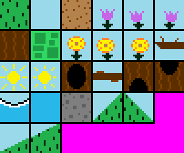

## Table of contents
{: .no_toc .text-delta }

1. TOC
{:toc}

---

# Map Tiles and Tilesets

## Map Tiles

In order to understand how the [map file](./map-file.md) is structured/read in, the concept of a "map tile" must be understood first.

Think of a map as a 2D grid. 
Each spot on the grid contains what is known as a "tile", which is a smaller graphic that fits into the grid at a particular spot. 
A map is made up by joining these small tile graphics together to create one large graphic representing the entire map.
For example, take a look at the below screenshot of a piece of a level:


This image is actually made up of individual tiles, such as the grass tile and the sign tile:


So the image seen above of the grass, sign, cobblestone and house is actually composed together by smaller individual tiles, which is known as a tile map:


Tiles make it very easy to build up a 2D map. 
The Map Editor makes the process of using smaller tiles to build up the entire map very obvious since the editor allows tiles to be placed down on a grid in a desired location of the map. 
Each tile will have a specified index in the map at an x and y location, e.g. the first tile in the top left corner would have an index of (0,0), the tile to the right of it would be (1,0) and the tile below it would be (0,1).

The class `MapTile` in the `Level` package represents a map tile, which is really just a standard sprite with an attribute for `TileType`. 
The `TileType` attribute determines how the tile is treated by the game -- for example, a tile type of `NOT_PASSABLE` means that the `Player` cannot walk over the tile, which is used on tiles like the pieces of the house in order for the player to not be able to walk on top of it.
The available tile types are included in the `TileType` enum in the `Level` package. 

## Map Tileset

A tileset is a collection of map tiles. Easy enough.

Graphic wise, a tileset defines each tile in one image. 
Below is the `CommonTileset.png` which is used by `TestMap` to construct its tile map. 
You will notice that the common tileset image is one big image with each individual map tile defined. 
Each map tile in a tileset must be the SAME width and height.



The `Tileset` class in the `Level` package represents a tileset, which contains a collection of `MapTile` objects. 
The way to define a tileset in this game is to create a class that extends from this `Tileset` class, such as the `CommonTileset` class in the `Tilesets` package.
From there, the extended `Tileset` class must call its super class with the following:
- The tileset image file to be used -- `CommonTileset` uses the `CommonTileset.png` file shown above
- The width and height for every tile in the tileset -- `CommonTileset` specifies that each tile graphic in the above image is 16x16
- The tileset scale, which is how much each tile in the tileset should be scaled by when drawn to the screen -- `CommonTileset` specifies a scale of 3, meaning each tile will be 48x48 pixels on screen

Additionally, the `Tileset` class method `defineTiles` must be overridden and have actual defined `MapTiles` added to it.

### Adding a map tile to a tileset

The setup for overriding the `defineTiles` method in a `Tileset` subclass looks like this:

```java
@Override
public ArrayList<MapTileBuilder> defineTiles() {
    ArrayList<MapTileBuilder> mapTiles = new ArrayList<>();
    return mapTiles;
}
```

From here, `MapTiles` can be added to the `ArrayList` -- kind of. 
This method actually defines a type of `MapTileBuilder`.
The class `MapTileBuilder`, which can be found in the `Builders` package, essentially defines a `MapTile` but does not instantiate it yet. 
It's not too important to fully understand this if you are unfamiliar with the builder pattern (you can read more about it [here](../game-patterns.md#builder-pattern)). 
I recommend that you use the already existing code in the `CommonTileset` class as a reference to guide you in adding a new `MapTile` to a tileset.

The following example in the `defineTiles` method adds the grass tile to the tileset, which is the first graphic in the top left corner of the above shown `CommonTileset.png` file:


```java
@Override
public ArrayList<MapTileBuilder> defineTiles() {
    ArrayList<MapTileBuilder> mapTiles = new ArrayList<>();

    // grass
    Frame grassFrame = new FrameBuilder(getSubImage(0, 0))
            .withScale(tileScale)
            .build();

    MapTileBuilder grassTile = new MapTileBuilder(grassFrame)
            .withTileType(TileType.NOT_PASSABLE);

    mapTiles.add(grassTile);

    // ...

    return mapTiles;
}
```

Whew, that's a bit confusing to look at I know! 
But the formatting here can be copied for every subsequent tile, so it can be treated as a template.

To start, a new `Frame` (details on `Frame` class [here](../game-object.md#animatedsprite-class)) must be created to represent the grass tile's graphic (`grassFrame`). 
The `FrameBuilder` class is used to build a `Frame` instance. 
In the constructor, `getSubImage(0, 0)` takes a piece of the tileset image (`CommonTileset.png`), which is the grass tile graphic.
Since `CommonTileset` defines the tile width and tile height as 16x16, the `getSubImage` method will start at location (0, 0) on the image and then take 16 pixels in both directions and return the resulting subimage, which is how the individual grass tile graphic gets returned.

Then, a `MapTileBuilder` class instance must be created to represent the actual `MapTile` (although it won't instantiate the `MapTile` at this time).
Here is where the grass tile (`grassTile`) is given the `TileType` `NOT_PASSABLE`, meaning the player cannot walk or fall through it (it is "solid").

Finally, the tile is added to the `mapTiles` list.

Let's do one for the sky tile now:


In the `CommmonTileset.png` image shown earlier, the sky tile is located to the left of the grass tile at index (0, 1).
With that slight difference in mind, nearly everything else will be the same for the sky tile as the grass tile:

```java
@Override
public ArrayList<MapTileBuilder> defineTiles() {
    ArrayList<MapTileBuilder> mapTiles = new ArrayList<>();

    // grass
    Frame grassFrame = new FrameBuilder(getSubImage(0, 0))
            .withScale(tileScale)
            .build();

    MapTileBuilder grassTile = new MapTileBuilder(grassFrame)
            .withTileType(TileType.NOT_PASSABLE);

    mapTiles.add(grassTile);

    return mapTiles;

    // sky
    Frame skyFrame = new FrameBuilder(getSubImage(0, 1))
            .withScale(tileScale)
            .build();

    MapTileBuilder skyTile = new MapTileBuilder(skyFrame)

    mapTiles.add(skyTile);

    // ...

    return mapTiles;

}
```

Unlike with the grass tile, the sky tile is not "solid" and can be passed through by the player, 
To achieve this, its `TileType` needs to be set to `PASSABLE`. 
This is the default tile type, so it does not need to be specified, but it can be by adding `.withTileType(TileType.PASSABLE)`.

### Adding an animated map tile to a tileset

Tiles can be animated! How fun!
Currently, the `CommonTileset` contains three animated tiles: the yellow flower, the purple flower, and the rising/falling water on the shore.
To set this up, the tileset image file must have a separate image for each frame in the tile's animation. 

For example, below are the frame tiles used for the flower (three different frame images):


The end goal is the following animation:


The code for this animated tile looks like this:

```java
// purple flower
Frame[] purpleFlowerFrames = new Frame[] {
        new FrameBuilder(getSubImage(0, 2), 65)
                .withScale(tileScale)
                .build(),
        new FrameBuilder(getSubImage(0, 3), 65)
                .withScale(tileScale)
                .build(),
        new FrameBuilder(getSubImage(0, 2), 65)
                .withScale(tileScale)
                .build(),
        new FrameBuilder(getSubImage(0, 4), 65)
                .withScale(tileScale)
                .build()
};

MapTileBuilder purpleFlowerTile = new MapTileBuilder(purpleFlowerFrames);

mapTiles.add(purpleFlowerTile);
```

Instead of just one `Frame` being created, an array of `Frame` instances is defined. 
Each `Frame` specifies its own subimage location, and its delay value (milliseconds), which is the amount of time that needs to pass before the animation transitions to its next frame.
Each frame in this animation has a delay of 500 milliseconds (half a second). This animation defines these four frames in the following order:


After each animation cycle, the animation will loop back to the beginning again. 
If the delay is set to -1, the animation will never move on from a frame without something else explicitly telling it to.

### Tile Types

The available tile types are defined in the `TileType` enum, and include:

- **NOT_PASSABLE** -- player cannot pass through it, they are "solid", such as the grass tiles
- **PASSABLE** -- player can pass through it, such as the sky tiles
- **JUMP_THROUGH_PLATFORM** -- the player can walk on top of it and cannot pass through it when coming downwards from above, but can pass through it when coming upwards from below, such as the tree branch tiles
- **WATER** -- the player can pass through it; this tile type is just for informational purposes so an entity can react to touching it (which the player does by changing to its swim animation)
- **SLOPE** -- the tile is a slope (incline) that the player can walk up or down; read more about slopes [here](#slope-tiles).

## Slope Tiles

A staple of the platformer drama, slope tiles (inclines) allow more creating more dynamic and interesting levels.
Believe it or not, implementing slopes in a 2D space is rather complex, and is probably one of the most logic-heavy features in this entire project.


### How slope tiles work

The entire game is based around rectangles -- all collisions use rectangle math, all map tiles are a tiny rectangle, the player is represented as a rectangle, etc.
Slopes, on the other hand, are clearly not able to be represented as pure rectangles due to their shape/properties.
As a result, an entirely new collision system needed to be implemented to allow slopes to work correctly.

For example, look at the below slope tile:


As the player walks forward (left or right) while on the ground, they are expected to follow the incline.


This is clearly not something that can be achieved with simple rectangle math alone.

Internally, each slope tile has a `tileLayout` property (represented by the `TileLayout` class), which has a 2D array property that represents each pixel of the slope tile.
The 2D array specifies which pixels of the slope are "passable" and while pixels of the slope are "not passable". 
Below is an example of what a slope's 2D array could look like:

```
0 0 0 1
0 0 1 1
0 1 1 1
1 1 1 1
```

Notice how the 1s (not passable) create a representation of the slope.
In the `Utils` class `SlopeTileLayoutUtils`, there are methods for creating tile layouts of different angled slopes, with scale support.

Slopes are also given a specified direction (left or right) based on which way the slope is facing.

Putting this all together, defining the above 45 degree slope looks like this (as seen in the `CommonTileset` class):

```java
// left 45 degree slope
Frame leftSlopeFrame = new FrameBuilder(getSubImage(3, 3))
        .withScale(tileScale)
        .build();

MapTileBuilder leftSlopeTile = new MapTileBuilder(leftSlopeFrame)
        .withTileType(TileType.SLOPE)
        .withTileLayout(SlopeTileLayoutUtils.createLeft45SlopeLayout(spriteWidth, (int) tileScale));
```

From here, in order to make slopes work, the engine runs additional code is included during collision checks to determine if a slope tile was collided with.
Essentially, slope tiles are initially treated by the regular collision engine as completely "passable".
After an entity moves, if they are inside of a slope tile, they will then be repositioned based on the tile layout.
The entity's current position inside the slope tile will be calculated against the tile layout, and if the entity is on a `1`, they will be pushed upwards until they are on a `0`.

There is also some extra logic to allow for an entity to "stick" to a slope when walking down it, as well as ensure an entity doesn't fall through a slope.

### Slope angles and layouts

The engine supports slopes with different angles and layouts.
Included already are slopes of a steady incline of both 45 degrees and 30 degrees, but any angle and layout should work.

Swapping out existing tiles with the same slope layout will work fine.

#### How to create a new slope angle or layout

The key to creating a new slope angle or layout is to get the 2D array representation of the slope to properly represent it.
This can be more challenging than it sounds at times, as tiles are scaled up by the engine, and a standard matrix scaling does not work with tile layouts.

For example, say I have the following slope tile layout:

```
0 0 0 1
0 0 1 1
0 1 1 1
1 1 1 1
```

If I were to scale this to be double in side and used regular matrix math, I would end up with the incorrect result of this:

```
0 0 0 0 1 1 1 1
0 0 0 0 1 1 1 1
0 0 1 1 1 1 1 1
0 0 1 1 1 1 1 1
1 1 1 1 1 1 1 1
1 1 1 1 1 1 1 1
```

The issue here is that this type of scaling messes with the inclines actual angle/trajectory, which will cause the player to jump extra pixels and will create "choppy" movement.

Instead, the tile layout should match the original incline while still being scaled, and should look something like this:

```
0 0 0 0 0 1 1 1
0 0 0 0 1 1 1 1
0 0 0 1 1 1 1 1
0 0 1 1 1 1 1 1
0 1 1 1 1 1 1 1
1 1 1 1 1 1 1 1
```

This is where the `TileLayout` methods in the `SlopeTileLayoutUtils` come in.
Their job is to properly create a tile layout and incorporate the desired scaling to esnure the layout comes out correctly.

The methods may look a bit convoluted, but they are really just doing some standard 2D array manipulation to place 0s and 1s in the correct spot.
I recommend creating one of these methods outside of this project to ensure the logic works and the layout looks as desired before putting it into the game, as it is must easier to test the logic without having to run the entire game every time.

### Slope rules

If an entity enters a slope from the bottom while grounded, they will be "lifted" to the next available `0` space in the tile layout upwards from where they currently are in the tile.
This means that even if the next `0` space is ten pixels up, the entity will be "teleported" there.

If an entity enters the top of a slope while grounded, logic will "stick" them to the slope in order to keep them grounded and walking downwards.

There is special logic in place to allow an entity to stand on the tip of a slope, as well as allow an entity to be between two slopes at once.

**Warning**: Only a slope's incline is factored into collisions.
This means that the other areas of the slope are considered "passable" and will teleport an entity weirdly if walked through.
It is preferred to ensure a slope either naturally transitions into another slope, or into a solid block.
If a standalone slope is required, a technique is to create an additional map tile that has one pixel thick bounds that can be used to cover the exposed non-incline sides.