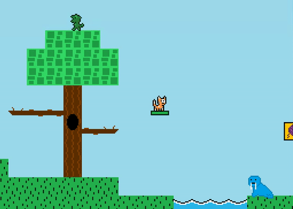

# Navigation Structure
{: .no_toc }

## Table of contents
{: .no_toc .text-delta }

1. TOC
{:toc}

---

# Collision Detection

## What is collision detection?

Collision detection is the ability for entities in the game, such as the player, to be able to detect "collisions" with other map entities,
such as map tiles, enemies, etc. This is generally done through checking if two entities "intersect" each other, at which point a collision
has occurred. Games are built around collision detection -- think of any of your favorite video games and tell me if the game would still work
if entities could not detect and react to colliding with other entities, and I guarantee you it cannot.

The hard part about collision detection is there are A LOT of different "scenarios" where a collision can occur between two entities,
and each entity needs to react accordingly to the collision in their designed way. All map entities in this game engine are rectangles (x, y, width, height),
which thankfully lessens a lot of the complexity that other shapes would introduce. Rectangles are the easiest shape to work with by far due to
"rectangle math" being relatively simple and they works out very nicely in a 2D space where only the x and y axis exist.

Also, this is always the hardest part about creating a game, and anyone will tell you that writing your own collision detection is the WORST when it comes to platformers
and especially with 3D games -- it is difficult, math is involved, and tiny errors randomly creep up just when you finally think you've gotten everything down pact.
In this game's case, getting proper decimal movement caused me a whole lot of trouble -- and I've even written code like this before for another game! It's just hard stuff, 
but I believe this game's collision detection is in a good state right now (it better be after all the time I put into it).

## Player collision detection with Map Tiles

**tl;dr**: This is probably the most complicated part of this game. Each frame the player moves by a specified amount unless it collides
with a solid map tile, in which case it is told to stop moving. Use the `moveXHandleCollision` and `moveYHandleCollision` methods for this functionality
instead of the generic `moveX` and `moveY` methods which don't account for collision.

The main reason for needing extremely precise collision detecting in a platformer game is for the player to be able to traverse the map
without being able to fall through the floor or run through obstacles.

The `GameObject` class contains two special move methods named `moveXHandleCollisions` and `moveYHandleCollision`. These methods
will move the player by a specified amount, and the `Player` calls these methods each frame to move it by a set amount based on whatever
actions the player took (such as walking forward). Unlike the plain `moveX` and `moveY` methods which simply move a player by a specified amount no questions asked,
the `moveXHandleCollision` and `moveYHandleCollision` methods will stop the player from moving if it collides with a "solid" entity,
such as a `NON_PASSABLE` map tile ("solid"). Each `MapTile` has an assigned [tile type](../MapSubSections/map-tiles-and-tilesets.md#tile-types), and the move handle collisions
methods will take these into account when moving the player to determine if a player is allowed to move to the new location or not.

Decimal movement makes this a bit more complex. While a player can be at a decimal location in game logic, in draw logic it cannot
since a graphic cannot be physically drawn on half of a monitor pixel. For this reason, while decimal precision is still possible to implement,
it just won't always apply a graphics update if the decimal movement is small enough to not change the round up or down to the nearest whole number.
For example, a decimal amount of `1.49` will round down to `1`, but `1.5` will round up to `2`.

So, how exactly do the `moveXHandleCollision` and `moveYHandleCollision` methods work? First thing they do is identify the amount of pixels the player is about to move,
the direction to move in, and lastly calculate decimal values to figure out if a potential round up or round down change will occur. From there,
the methods will move the player one pixel at a time over and over again until it reaches the total amount the player is supposed to move by.
During each one pixel move, collisions are checked against the map tiles, and if a collision is detected the movement is stopped and all leftover
movement is thrown away. Lastly, decimal values are recalculated and figured out (if a round up occurs, one more pixel is moved and collision detection
is checked one last time).

The `Player` calls these two methods from the `GameObject` class each frame in its `update` logic:

```java
super.moveYHandleCollision(moveAmountY);
super.moveXHandleCollision(moveAmountX);
```

The class `MapTileCollisionHandler` is used by the move handle collisions methods to determine if a collision occurred, and if a collision
did occur the player's position is adjusted to be right in front of the solid map tile it collided with.

The `MapTileCollisionHandler` contains three methods: `getAdjustedPositionAfterCollisionCheckX`, `getAdjustedPositionAfterCollisionCheckY`,
and `hasCollidedWithMapTile`. 

The first two methods `getAdjustedPositionAfterCollisionCheckX` and `getAdjustedPositionAfterCollisionCheckY` do some "rectangle math" to determine which tiles in the map need to be checked for collisions.
A common mistake newer game developers make is writing collision checking code that checks against every single tile in the map every single time -- this is a huge
waste of resources and can actually harm FPS as the game logic step can end up taking too long. Instead, this code will determine the direction the player is moving,
and based on that only check the immediate tile(s) in the vicinity. Just like with sorting algorithms, lowering the amount of comparisons
is key to have a smoothly running game! From there, they will call the third method `hasCollidedWithMapTile` on each map tile that is determined to intersect with the player
and see if that is determined a collision based on the map tile's tile type.

The `hasCollidedWithMapTile` method is very simple compared to the monstrous other two adjust position methods. It determines
if the tile a player intersects with is considered a "collision" or not. This is 100% based on the tile's tile type. A tile type of `NOT_PASSABLE`
would return true to there being a collision. `PASSABLE` tiles cannot be collided with and would always return false.
`JUMP_THROUGH_PLATFORM` tiles have a bit of a more complex check, because for a collision to occur the player has to be moving downwards and their
bottom hurtbox has to be overlapping the jump through platform's top hurtbox. Overall though this method is very simple when looking at it:

```java
private static boolean hasCollidedWithMapTile(GameObject gameObject, MapTile mapTile, Direction direction) {
    switch (mapTile.getTileType()) {
        case PASSABLE:
            return false;
        case NOT_PASSABLE:
            return gameObject.intersects(mapTile);
        case JUMP_THROUGH_PLATFORM:
            return direction == Direction.DOWN && gameObject.intersects(mapTile) &&
                    Math.round(gameObject.getScaledBoundsY2() - 1) == Math.round(mapTile.getScaledBoundsY1());
        default:
            return false;
    }
}
```

More tile types can easily be added to this method to determine if a collision occurred or not. The other two methods don't really have to be
modified at all, new tiles types added to this `hasCollidedWithMapTile` method will work just as the existing three tile types do.

## Player collision detection with Enhanced Map Tiles

Additionally, these methods check against all active [enhanced map tiles](../MapSubSections/enhanced-map-tiles.md) in the map, as they
are to be treated like regular map tiles in terms of collision detection (enhanced map tiles have a tile type attribute!). So for example,
the game's green horizontal moving platform would also be checked against during this code.

Although standard collision detection on enhanced map tiles is done here, `EnhancedMapTile` classes can run their own
`update` logic to do other actions when intersecting with a player. For example, the green horizontal moving platform's class carries out
its own logic upon determining that it overlaps with a player in order to move the player as it moves.



## Player collision detection with Enemies

The `Player` actually does not seek out collision detection with enemies -- instead each `Enemy` class will seek out a collision
detection aganist the player. This allows an `Enemy` to specify to the `Player` class what to do upon being touched. For example,
the enemies in the game (coming from the generic `Enemy` class) call the `Player` class's `hurtPlayer` method upon intersecting with the player,
and the `Player` can then determine how it "hurts" itself (as of now, the player dies and it's a game over).

## Player collision detection with NPCs

Just like with enemies, the `NPC` detects when it intersects with a player, which is how it determines the player is in radius and 
is able to be talked to.

## Enemy collision detection with the Map

Enemies often follow collision detection rules, and are free to use the same `GameObject` methods `moveXHandleCollision` and `moveYHandleCollision`
to abide by tile type rules.

## Player class reacting to a collision

The `GameObject` method provides two methods that are intended to be overridden by a subclass: `onEndCollisionCheckX` and `onEndCollisionCheckY`.
After a collision check has been done, the collision methods will let the `Player` class (or any other `GameObject` subclass like the `Enemy` class that moves
while checking for collisions) know if a collision occurred and what direction the collision happend from (left, right, up, or down).

The `Player` class uses the `onEndCollisionCheckY` method to determine its `airGroundState` -- if a the player collides
with a map tile downwards, it means that the player is landed on the ground and is no longer in the air. This causes
the player to set its `airGroundState` to `GROUND`. Additionally, the reverse is true -- if the player is not colliding
with a map tile downwards, it means the player is in the air, which causes its `airGroundState` to be set to `AIR`. The method also
stops the player from jumping upwards if it collides with a map tile upwards.

```java
@Override
public void onEndCollisionCheckY(boolean hasCollided, Direction direction) {
    if (direction == Direction.DOWN) {
        if (hasCollided) {
            momentumY = 0;
            airGroundState = AirGroundState.GROUND;
        } else {
            playerState = PlayerState.JUMPING;
            airGroundState = AirGroundState.AIR;
        }
    } else if (direction == Direction.UP) {
        if (hasCollided) {
            jumpForce = 0;
        }
    }
}
```

The `BugEnemy` class also uses this feature. It uses the `onEndCollisionCheckX` to determine if a collision happend, and if so it turns itself
around and walks the other direction.

```java
@Override
public void onEndCollisionCheckX(boolean hasCollided, Direction direction) {
    if (hasCollided) {
        if (direction == Direction.RIGHT) {
            facingDirection = Direction.LEFT;
            currentAnimationName = "WALK_LEFT";
        } else {
            facingDirection = Direction.RIGHT;
            currentAnimationName = "WALK_RIGHT";
        }
    }
}
```