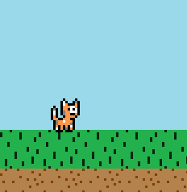
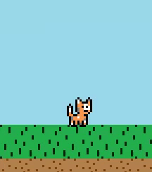
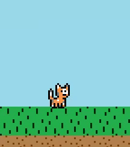

# Navigation Structure
{: .no_toc }

## Table of contents
{: .no_toc .text-delta }

1. TOC
{:toc}

---

# Player States

The `Player` has several different states it can be in based on the value of its `playerState` instance variable.
Each state can lead to another state based on the player's actions each cycle of the game loop. The states also dictate
which animation/frames the player should switch to (e.g. player walking animation when in the `WALKING` state)
The `PlayerState` enum in the `Level` package define the following states that the player can be in:
- **STANDING** -- player is standing still
- **WALKING** -- player is walking
- **JUMPING** -- player is jumping (or falling)
- **CROUCHING** -- player is crouching

## Player Standing State



If the player is on the ground and no keys are pressed, the player will enter its `STANDING` state, where it does nothing
and just waits for another key to be pressed which will activate another state. The `playerStanding` method contains
the simple logic for the `STANDING` state, which looks like this:

```java
protected void playerStanding() {
    currentAnimationName = facingDirection == Direction.RIGHT ? "STAND_RIGHT" : "STAND_LEFT";
    if (Keyboard.isKeyDown(MOVE_LEFT_KEY) || Keyboard.isKeyDown(MOVE_RIGHT_KEY)) {
        playerState = PlayerState.WALKING;
    } else if (Keyboard.isKeyDown(JUMP_KEY) && !keyLocker.isKeyLocked(JUMP_KEY)) {
        keyLocker.lockKey(JUMP_KEY);
        playerState = PlayerState.JUMPING;
    } else if (Keyboard.isKeyDown(CROUCH_KEY)) {
        playerState = PlayerState.CROUCHING;
    }
}
```

It really just checks for key presses and if so sets the player to a new state. Not much else to do when you're standing still.

While standing, the player uses either the `STAND_RIGHT` or `STAND_LEFT` animation.

### Player Walking State



If the player is on the ground and either the right or left arrow key is pressed, the player will enter its `WALKING` state,
where it will move either left or right in the level. If no keys are pressed while in this state, the player will stop moving and go
back into its `STANDING` state. How fast the player walks is determined by the `walkSpeed` instance variable. The `playerWalking` method
contains the logic for the `WALKING` state. The player will change the direction it's facing based on which arrow key is pressed.

While walking, the player uses either the `WALK_RIGHT` or `WALK_LEFT` animation.

### Player Jumping State


This state's logic is a bit more complicated from the others.
If the player is on the ground and presses the up arrow key, the player will enter its `JUMPING` state. The player's `airGroundState` will
be changed to `AIR`, and the player will start rising until gravity catches up, at which point the player will fall downwards until it
hits the ground again, at which point the player's `airGroundState` will be changed back to `GROUND` and the player will transition
into either a standing or walking state. While in the air in the `JUMPING` state, the player can move left and right, but will not change
the direction it is facing. The player is still considered in `JUMPING` state while it is falling downwards, and if the player runs off the edge
of a cliff and ends up in the air, that is also considered `JUMPING` state -- basically if the player is in the air, it is put in
`JUMPING` state. I probably should have made a separate falling state but...meh it's not really needed.

The player's jumping physics are all determined through instance variable values(`gravity`, `jumpHeight`, `jumpDegrade`, `terminalVelocityY`, and `momentumYIncrease)
which alter how high the player jumps, how fast the player falls, and what the peak of the jump looks like in terms of motion (e.g. the player can go up and then go right down after reaching
the peak of the jump, or the player can reach the peak and wait a bit and slowly begin to pick up falling speed).

The actual jump algorithm doesn't do all that much. When up is pressed, the user's y velocity is decreased (moving upwards) by the value of `jumpHeight`
each frame. Each frame, `jumpHeight` is lowered slightly by `jumpDegrade`, until eventually no more upwards y velocity is applied to the player.
When this happens, the user starts to fall as gravity takes over. Each frame, gravity is always added to the player (just like in real life,
gravity is always in effect!). Also, each frame the user's momentum downwards is slightly increased by the value of `momentumYIncrease`. This gives off the effect
that the player is falling faster over time, until it reaches its fall speed reaches the value of `terminalVelocityY`, at which point it can no longer increase in fall speed.
Once the player touches the ground, the jump/fall ends.

While rising upwards (jumping), the player uses either the `JUMP_RIGHT` or `JUMP_LEFT` animation. While falling downwards,
the player uses either the `FALL_RIGHT` or `FALL_LEFT` animation.

### Player Crouching State



If the player is on the ground and presses the down arrow key, the player will enter its `CROUCHING` state. Basically, the player goes
lower to the ground to shrink its hurtbox, but that's all it does (and the player cannot walk out of `CROUCHING` state, but they can jump out of it).