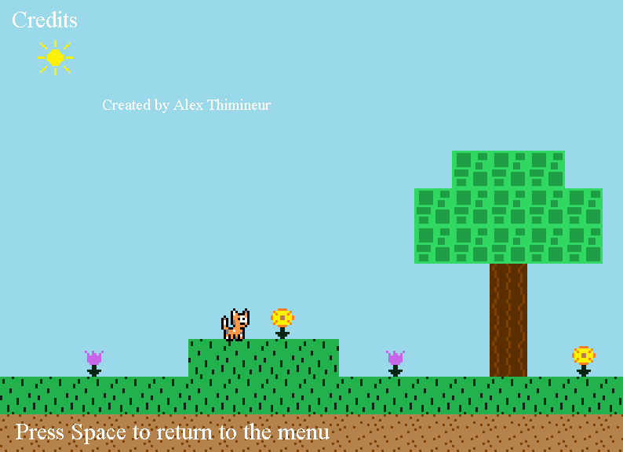

## Table of contents
{: .no_toc .text-delta }

1. TOC
{:toc}

---

# Credits Screen

The credits screen handles the logic and graphics related to displaying the game's credits to the user. 
It is loaded when the "CREDITS" option is selected form the game's main menu.



The class file for it is `CreditsScreen.java`, which can be found in the `Screens` package.

## Functionality
 
This screen is pretty limited. All it does is display the graphics shown in the above screenshot. 
When the space button is pressed, `CreditsScreen` will change `ScreenCoordinator's` game state back to MENU to load the 
`MenuScreen` back up.

```java
if (Keyboard.isKeyUp(Key.SPACE)) {
    keyLocker.unlockKey(Key.SPACE);
}
if (!keyLocker.isKeyLocked(Key.SPACE) && Keyboard.isKeyDown(Key.SPACE)) {
    screenCoordinator.setGameState(GameState.MENU);
}
```

Super simple.
You may notice that it first checks if the space key is not pressed, and if so will "unlock" the key (check out the `KeyLocker` class documentation [here](../game-patterns.md#key-locker) for more information on how that works).
Then if the space key is unlocked and pressed, the screen returns back to the menu screen. 
The reason that this key locking mechanism is included is that the space button is pressed in order to intially go from the menu screen to this credits screen. 
Because of how fast the game loop iterates, before the space key is released, it would likely detect it as multiple presses -- and as a result, one space press would go back and forth from menu to credits and back multiple times extremely quickly. 
By "locking" the space key when the `CreditsScreen` is initialized, and then only unlocking it when the space key is released, it forces the player to release and re-press the space key again rather than being able to hold it down. 
The `MenuScreen` also has this same functionality implemented with the space key for this reason.

## Graphics

Like the `MenuScreen` class, the `CreditsScreen` class uses a `Map` (`TitleScreenMap.java` in the `Maps` package), which is the same type of `Map` class which is used when actually playing the main game. 
While any image could have been used, I thought it'd be more fun to use a map as the background.

All of the text shown on screen is created with various `SpriteFont` graphics defined in the class, which are setup in the `initialize` method.