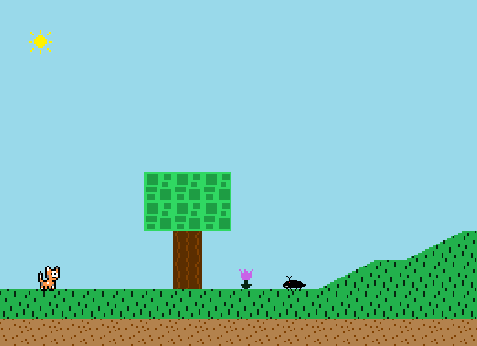
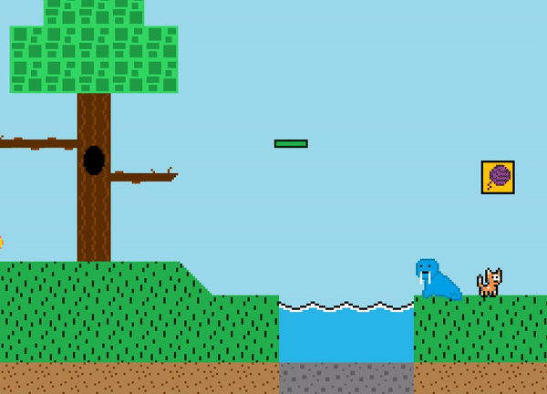

## Table of contents
{: .no_toc .text-delta }

1. TOC
{:toc}

---

# Play Level Screen

The play level screen handles the logic and graphics related to playing the actual platformer game. It is loaded when the "PLAY GAME" option is selected form the game's main menu. 



The class file for it is `PlayLevelScreen.java` which can be found in the `Screens` package.

## Functionality

This is the screen where the platformer game happens. The map and player are loaded and the game carries out from there until the level
is beaten or the player dies. Despite the `PlayLevelScreen` class having to seemingly do so much, a vast majority of the platformer game code
is abstracted away from it (mostly residing in the `Player` and `Map` classes) which keeps the screen's code pretty simple and easy to follow.

The `PlayLevelScreenState` enum defined in the class is used to determine what the `PlayLevelScreen` should be doing at a specific point in time --
its "current state" is stored in the `playLevelScreenState` instance variable. There are several different states that the `PlayLevelScreen` can be in:
- **RUNNING** -- platformer game is currently running (map is loaded, player can move around/jump, etc.)
- **LEVEL_COMPLETED** -- the level has been completed (beaten), which happens when the player hits the golden box at the end of the level
- **LEVEL_LOSE** -- the player has lost the level by being killed by an enemy, which happens if you touch an enemy

### Running State

The `RUNNING` state is the default state that the `PlayLevelScreen` is set to when it first loads.

As mentioned earlier, while this state does have the most going on considering it's the actual game itself being run,
nearly all of the game code is abstracted away to the `Map` and `Player` classes. 
This is the only thing `PlayLevelScreen` has to do for this state during its update and draw cycles:

`update` method:
```java
player.update();
map.update(player);
```

and

`draw` method:
```java
map.draw(graphicsHandler);
player.draw(graphicsHandler);
```

Basically, the `Map` and `Player` classes are updated and drawn each cycle, and they handle the rest of the work.
The specific `Map` and `Player` class instance used for the level is defined in the screen's `initialize` method -- at the moment
this game currently only has one playable map (`TestMap.java` file in the `Map` package) and one player type (`Cat.java` file in the `Players` package).
From there, the `PlayLevelScreen` just continually calls their `update` and `draw` methods to carry out the platformer game. The documentation
for the `Map` class is located [here](../map.md), and for the `Player` class is located [here](../player.md).

When in this state, the platformer game can be played!


### Level Completed State

When the player reaches the end of the level and hits the gold block, the level is "completed" and the `PlayLevelScreen's` state
is changed to `LEVEL_COMPLETED`. Note that this state change is actually triggered by the `Player`, which calls the `PlayLevelScreen's` `onLevelCompleted`
method when it has beaten the level in order for `PlayLevelScreen` to know to change states. When in this state, the "Level Cleared" screen is loaded, which is
a separate `Screen` class (`LevelClearedScreen.java`).



The "Level Cleared" screen's only job is to paint the entire screen black and 
show the "Level Cleared" text. The `PlayLevelScreen` sets up and loads the `LevelClearedScreen` from within itself,
rather than making a separate entry in the `ScreenCoordinator` class. This structure is important in order to not bloat the `ScreenCoordinator` class, as the `ScreenCoordinator` class should really only be used for the "core" screens of the game. While it may seem to not make much sense to have created an entire separate screen class for `LevelClearedScreen` for such a tiny amount of functionality, it keeps the game code organized -- if in the future the graphics for the level cleared
screen were to get more complex and involved, keeping the screens separate prevents bloating of the `PlayLevelScreen` class.

After the Level Cleared screen is displayed for a set amount of time, it automatically switches the game state back to the main menu.

### Level Lose State

When the player dies in the level from touching an enemy, the level is "lost" and the `PlayLevelScreen's` state is changed to `LEVEL_LOSE`.
Note that this state change is actually triggered by the `Player`, which calls the `PlayLevelScreen's` `onDeath`
method when it has died in a level in order for `PlayLevelScreen` to know to change states. When in this state, the "Level Lose" screen is loaded, which is
a separate `Screen` class (`LevelLoseScreen.java`).


The "Level Lose" screen paints the screen black and shows the "You lose!" text,
as well as the text with instructions for what the player can do from this screen (press the space key to restart the level, or press
the escape key to go back to the main menu). The `LevelLoseScreen` class handles detecting those key inputs and sets `ScreenCoordinator's` game state
accordingly based on what the user presses -- which is essentially just this:

```java
// if space is pressed, reset level. if escape is pressed, go back to main menu
if (Keyboard.isKeyDown(Key.SPACE) && !keyLocker.isKeyLocked(Key.SPACE)) {
    playLevelScreen.resetLevel();
} else if (Keyboard.isKeyDown(Key.ESC) && !keyLocker.isKeyLocked(Key.ESC)) {
    playLevelScreen.goBackToMenu();
}
```

The `LevelLoseScreen` class is passed the `PlayLevelScreen` instance to allow for calling its instance methods.
The `PlayLevelScreen` class exposes methods for `resetLevel` and `goBackToMenu` to make the code more readable.