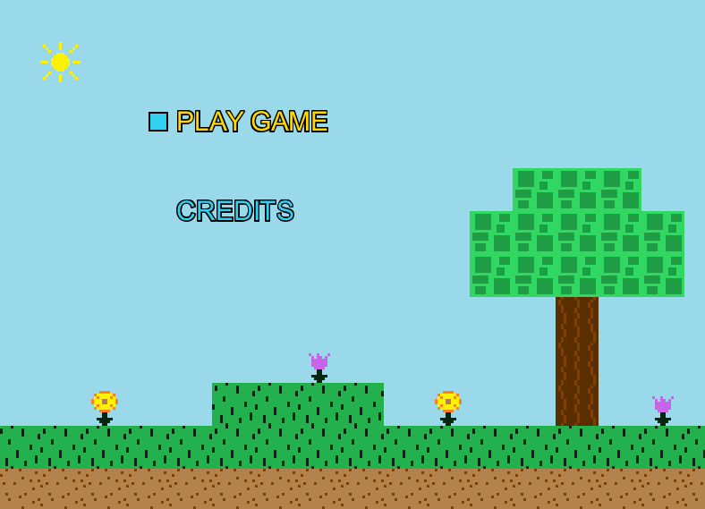
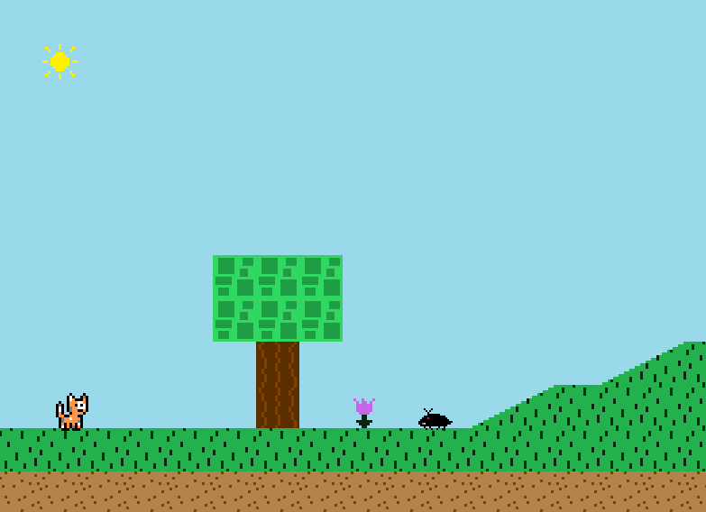
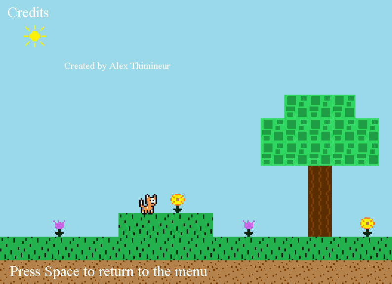

## Table of contents
{: .no_toc .text-delta }

1. TOC
{:toc}

---

# Screen Coordinator

## What is the Screen Coordinator?

The `ScreenCoordinator` class in the `Game` package is integral for bringing the entirety of the game's code together.
Its job is to dictate which section (screen) of the game to load at a given time. This class is attached to the engine's game loop
in the `Game.java` file, and from there it coordinates what happens and when it happens. Each screen contains code for updating game logic
and drawing graphics for a piece of the game.

## What Screens can the Screen Coordinator currently load?

Currently, there are three main screens that the `ScreenCoordinator` class can load: the menu screen, the credits screen,
and the play level screen. The menu screen is always loaded at the start of the game (which you see when the game first starts up):



When the "Play Game" option on the menu screen is selected, the `ScreenCoordinator` class responds by loading the play level screen (which starts the platformer game level):



And finally, when the "Credits" option on the menu screen is selected, the `ScreenCoordinator` class responds by predictably loading the credits screen:



The `ScreenCoordinator` can support as many screens as necessary -- there is no limit!

## Game State

The `ScreenCoordinator` class has an instance variable for keeping track of the current game state. This `gameState` variable
can be of any type defined in the `GameState` enum, which can be found in the `GameState.java` file located in the `Game` package.

The current states defined in the `GameState` enum are `MENU`, `LEVEL`, `CREDITS`, which all coincide with a specific screen.
Based on the value of the `gameState` instnace variable, the `ScreenCoordinator` will choose to load its corresponding screen. How
this is done can be seen in the below snippet of the `ScreenCoordinator's` `update` method:

```java
switch(gameState) {
    case MENU:
        currentScreen = new MenuScreen(this);
        break;
    case LEVEL:
        currentScreen = new PlayLevelScreen(this);
        break;
    case CREDITS:
        currentScreen = new CreditsScreen(this);
        break;
}
```

The `ScreenCoordinator` will only change screens when it detects that its `gameState` has been changed. The class exposes
a method `setGameState` which any other class can use to change the current game state and force `ScreenCoordinator` to load a different
screen. As you can see in the above code snippet, `ScreenCoordinator` is passing an instance of itself into each screen instance (e.g. `MenuScreen`).
This allows those screen classes to set the game state of `ScreenCoordinator` when necessary. An example of where this is used is when the `MenuScreen` is loaded
and the player selects the "Play Game" option -- this causes the `MenuScreen` to set `ScreenCoordinator's` game state to `LEVEL`, which triggers it to load
the `PlayLevelScreen` class (as shown in the above `switch` statement).


