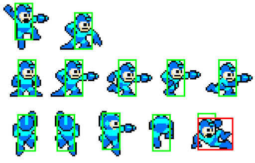

## Table of contents
{: .no_toc .text-delta }

1. TOC
{:toc}

---

# Game Object

## What is a Game Object?

Inspired by the [Unity](https://unity.com/) game engine, the class `GameObject` (along with the entire package `GameObject`) was
created as a sort of "one stop shop" for creating game entities. The `GameObject` package contains a series of classes that all work
together which ultimately build up to the `GameObject` class containing all necessary information and functionality required for a map entity,
which makes it quick and easy to use without requiring the code logic used to be rewritten again and again.

In this game, the `GameObject` class is subclassed by every map entity, which includes the [player](./player.md), 
and any subclasses of `MapEntity` which include [enemies](./MapSubSections/enemies.md), [NPCs](./MapSubSections/npcs.md), and [map tiles](/GameDetails/Map/MapTilesAndTilesets) (as well as [enhanced map tiles](./MapSubSections/enhanced-map-tiles.md), which derive from the `MapTile` class).
That means that all of these subclasses (and their subclasses) include all functionality of the `GameObject` class under the hood.

## Features of the GameObject class

The `GameObject` class provides the following features for every subclass:

1. Sprite logic (loading in images, scaling images, flipping images, defining a bounding box which can be thought of as a "hurtbox")
2. Animation support and logic (and the ability to switch between different animations)
3. Graphical support -- will automatically handle drawing graphics at the correct screen location based on map/camera position
4. Collision detection with other GameObjects, including collision detection with map set pieces (like map tiles)

## Subclassing GameObject

The `GameObject` class can be subclassed by any entity regardless of what it is or what it will be doing in game, 
and it contains many constructors to support a variety of needs. Generally, each `GameObject` at the very least contains
an image (sprite) that is to be attached to a rectangle (x, y, width, height) to be displayed and moved around in game.

## GameObject Package Overview

As mentioned earlier, the classes in the `GameObject` package work together and build up to the `GameObject` class.

### Rectangle class

The `Rectangle` class is the "base", which is a means to implement the `x`, `y`, `width`, and `height` instance variables which every
`GameObject` needs. It also contains some simple "rectangle" math such as detecting collision and moving a rectangle in different directions.

### Sprite class

The `Sprite` class extends the `Rectangle` class. The `Sprite` class adds functionality for "attaching" an image.
It also optionally allows for defining a bounding box `bounds`, which is a `Rectangle` used in collision detection -- often times when working with collision detection,
only a part of a sprite's image should be able to be "touched". An example of this can be seen in nearly any video game. 
If you look at the following Megaman sprites, the bounding box where collisions can be detected on the player in the game [Megaman 2](https://www.youtube.com/watch?v=vuJ8Qr-3_zg) is much smaller than Megaman himself:

When working with 2D games, it's common to leave off limbs like in the above picture and only have the core body be able to be
detected for collision. Otherwise, weird graphical oddities can happen, and the player can end up feeling too "big" and clunky.

### AnimatedSprite class

The `AnimatedSprite` class is the most complex class of the `GameObject` package group.
This class does NOT extend the `Sprite` class.
Instead, it contains a `HashMap` which maps a string value (animation name) to an array of `Frame` type (animation data and graphics). 

An array of `Frames` is what defines an animation. Each `Frame` in the array is one piece of an animation,
and the game will cycle through the collection of frames continuously. Upon reaching the last frame of an animation, it will loop automatically starting back at the first frame.
The `Frame` class extends the `Sprite` class with an added `delay` instance variable which specifies how long an animation frame is to
last before switching over to the next frame. `Frames` in the same animation can have different `delay` values. Also, an `AnimatedSprite` class instance can have
any number of animations defined, and animations can be switched between at well.

Something to keep in mind is that the `AnimatedSprite` class supports animation, but it doesn't require it. There is functionality in place to allow just one `Frame` instance
be used, and the class will essentially treat it just as the `Sprite` class would. This is commonly seen throughout the game, as there are many times where a `GameObject` is desired that is just one image. 

Even though it doesn't directly extend `Sprite`, the `AnimatedSprite` class is structured to be treated
in game exactly as a `Sprite` would. At any given time, the `AnimatedSprite` class will have a current animation with a current frame,
and this current frame is a `Sprite` class instance with a location, collision bounds, etc. While an `AnimatedSprite` is a "collection" of various
`Sprites` at the end of the day, it does only have one "active" `Sprite` out at a time. As a result, the `AnimatedSprite` class
redefines nearly every method from the `Sprite` and `Rectangle` classes to have them utilize the `currentFrame` variable's information.
As a result, an `AnimatedSprite` has all the behavior of the `Sprite` class without needing to extend it. I know this sounds a bit silly,
but I originally did have it extend from the `Sprite` class and after some time I found that the drawbacks for doing that greatly
outweigh the minor inconvenience of having to redefine some methods. In a way, the `AnimatedSprite` class can be thought of as a "Sprite coordinator" or "Animation coordinator" class.

Finally, there is an included `loadAnimations` method, that any subclass can override in order to define its own animations. This is commonly used throughout the game's code
to separate out where animations are defined from other game logic.

### GameObject class

The `GameObject` class extends from the `AnimatedSprite` class. The `GameObject` is to be given an instance
of the current `Map` being used through its `setMap` method after creation in order for it to provide important functionality to entities such as move methods that handle map tile collisions (`moveXHandleCollision` and `moveYHandleCollision`) and special `draw` logic to convert "map coordinates" to "screen coordinates" to ensure entities are painted to the screen in the correct location.

The `GameObject` class has some sneaky constructor crafting in order to allow it to be instantiated both as an animated sprite (nearly every entity uses this such as the `Player` and enemies like `BugEnemy`) or just as one sole sprite (which is done in the `HorizontalMovingPlatform` class).

More details on the `GameObject` class's collision detection and handling can be found [here](./PlayerSubSections/collision-detection.md).

Finally, `GameObject` adds two methods `getCalibratedXLocation` and `getCalibratedYLocation` which are used in the `draw` cycle
to properly draw the `GameObject` to the screen in the correct location with account to how much the map's camera has moved. `GameObject` class instances should
utilize these methods in their `draw` methods to ensure other graphics are drawn relative to them and still maintain proper draw location
integrity. The `Walrus` class does this when drawing its speech bubble when talked to, which ensures as the camera moves the speech bubble
graphics will remain in the correct spot relative to the walrus game object's location and the camera's location.

Note that if no `Map` class instance is passed in a `GameObject` class using the `setMap` method, the `GameObject` will draw itself
at its exact location on the screen rather than accounting for the map camera moving. This can be desired behavior for certain graphics,
while not for others.