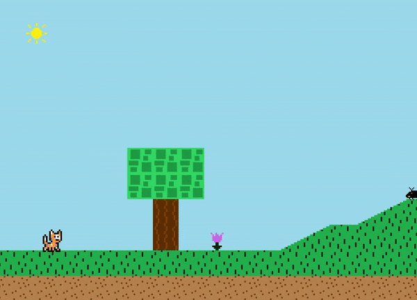

# Navigation Structure
{: .no_toc }

## Table of contents
{: .no_toc .text-delta }

1. TOC
{:toc}

---

# Player

## What does the Player class do?

The `Player` class (found in the `Scene` package) is responsible for everything to do with the player (for this game, the player is the cat) 
during the platformer game except for the player character, which includes the player's graphics, movement, and interactions with the map (such as collision detection).

In the gif below, everything the cat is doing and how it is interacting with the map is handled by the `Player` class.

The `Player` class extends off the `GameObject` class, so everything in the [game object](./game-object.md) documentation applies to the `Player` class as well
(any instance variables, animation setup, etc.)