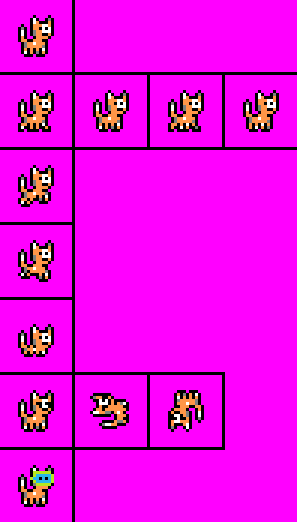
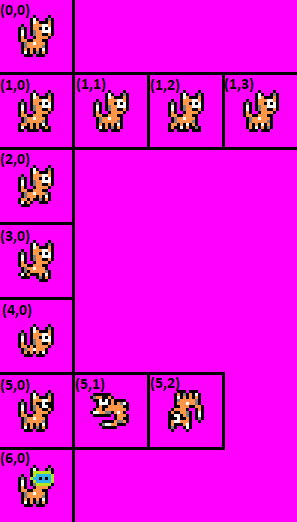
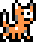

# Navigation Structure
{: .no_toc }

## Table of contents
{: .no_toc .text-delta }

1. TOC
{:toc}

---

# Game Object With Animations

Every `GameObject` subclass automatically has support for animations. An animation is an array of `Frame` class data.
Different graphics for each frame should come from a sprite sheet image file. Generally, if you are creating a `GameObject`
with animations, a new class that extends of `GameObject` should be created to separate out the animation data.

## Sprite Sheet

The `SpriteSheet` class is used to define a sprite sheet that the `AnimatedSprite` class uses for loading animation graphics.
A sprite sheet is one image file that contains multiple graphics (frames images) for a sprite. For example, below
is the sprite sheet image file for the cat player character (the image file is `Cat.png`:



Each sprite image on the sprite sheet must be the same size, and each image must have one pixel in between it and
another image that would come next to or below it (to keep track of separate images, I drew black squares around each image, which also
adds the one pixel buffer between each image).
For the cat sprite sheet above, each sprite is 24x24 pixels. Animations for each sprite are shown in a horizontal line,
so the cat walking animation for example is four different frames. This is not a requirement, images on a sprite sheet can be placed
anywhere, but I find it easier to manage animations by organizing them like this.

From here, a `SpriteSheet` class instance can be created, which will be passed into the `GameObject` class to be used to setup animations.
Here is an example of creating a `SpriteSheet` instance that the `Cat` class uses with the above cat sprite sheet image:

```java
new SpriteSheet(ImageLoader.load("Cat.png"), 24, 24)
```

The 24x24 is the size of each sprite in the sheet (height and width).

## Defining animations in a `GameObject` subclass

Any class that extends `GameObject` can override `GameObject's` `getAnimations` method, which will load defined animations into the class
upon initialization. The setup to override this method looks like this:


```java
@Override
public HashMap<String, Frame[]> getAnimations(SpriteSheet spriteSheet) {
    return new HashMap<String, Frame[]>() {{
        
    }};
}
```


The `AnimatedSprite` class keeps track of animations with a `HashMap` that maps the name of an animation (String) to an array of `Frame` data (which
can be thought of as an array of sprites with their own information like graphics, bounding collision rectangle, etc.). In this method,
animations can easily be added directly to this `HashMap` through the use of the earlier defined `SpriteSheet`. 

Since every image in a sprite sheet must be the same size, the `SpriteSheet` class is able to provide a `getSprite` method that will 
grab a particular graphic from the sheet based on row and column index. 
For example, in the above cat sprite sheet image, sprite index (0, 0) would be the standing cat in the top left corner.
Sprite indexes (1, 0), (1, 1), (1, 2), and (1, 3) would equate to each of the cat walking images (the cat walking sprites
are in row 1 of the sprite sheet, and there are then four columns with one image in each.



### One frame animation

Using this `getSprite` method from the `SpriteSheet` class, it makes defining each animation easy. Below is an example from the `Cat` class
which defines a one frame animation of the cat standing still. There are two separate versions of this animation defined: a stand right animation,
and a stand left animation (which will flip the image horizontally -- no need to do it manually when it can be done through code):


```java
@Override
public HashMap<String, Frame[]> getAnimations(SpriteSheet spriteSheet) {
    return new HashMap<String, Frame[]>() {{
    
        // adds STAND_RIGHT animation
        put("STAND_RIGHT", new Frame[] {
                new FrameBuilder(spriteSheet.getSprite(0, 0), 0)
                        .withScale(3)
                        .withBounds(8, 9, 8, 9)
                        .build()
        });
    
        // adds STAND_LEFT animation
        put("STAND_LEFT", new Frame[] {
                new FrameBuilder(spriteSheet.getSprite(0, 0), 0)
                        .withScale(3)
                        .withImageEffect(ImageEffect.FLIP_HORIZONTAL)
                        .withBounds(8, 9, 8, 9)
                        .build()
        });
    }};
}
```


This uses the [builder pattern](/GameDetails/GamePatterns#builder-pattern) with the `FrameBuilder` class to build a `Frame` object instance.
The animations are put into the `HashMap` by first specifying a String for the animation's name (e.g. "STAND_RIGHT" and "STAND_LEFT").

Notice that both standing animations specify the sprite sheet image index of (0, 0) (cat at top left corner standing still),
a delay value of 0 (since this animation is one frame there is no need to specify a delay value),
and then several attributes ar eset such as `scale`, `imageEffect`, and `bounds`. These are all optional parameters and have default values
if not specifically set (for example, if no `withImageEffect` is specified, the image by default will not have any image effects like flipping horizontally
applied to it).

### Animations with multiple frames

While one frame animations are fine at times, most animations have multiple frames, such as in the above cat sprite sheet 
where there are four frames for the cat walking. The same method for adding one frame animations also works for multiple frame animations,
just instead of passing in one `Frame`, an array of `Frame` will be used.

Below is an example from the `Cat` class which defines the "WALK_RIGHT" animation, which
has four frames image indexes (1,0), (1,1), (1,2), and (1,3):


```java
@Override
public HashMap<String, Frame[]> getAnimations(SpriteSheet spriteSheet) {
    return new HashMap<String, Frame[]>() {{
    
        // add WALK_RIGHT animation
        put("WALK_RIGHT", new Frame[] {
               new FrameBuilder(spriteSheet.getSprite(1, 0), 200)
                       .withScale(3)
                       .withBounds(8, 9, 8, 9)
                       .build(),
               new FrameBuilder(spriteSheet.getSprite(1, 1), 200)
                       .withScale(3)
                       .withBounds(8, 9, 8, 9)
                       .build(),
               new FrameBuilder(spriteSheet.getSprite(1, 2), 200)
                       .withScale(3)
                       .withBounds(8, 9, 8, 9)
                       .build(),
               new FrameBuilder(spriteSheet.getSprite(1, 3), 200)
                       .withScale(3)
                       .withBounds(8, 9, 8, 9)
                       .build()
        });     

    }};
}
```


That's it! A `Frame` array is used, and multiple `FrameBuilders` are then used to build each `Frame`. Notice the `delay`
for each `Frame` is set to 200 -- this means that if "WALK_RIGHT" is the current animation, every 200 milliseconds the game will change the current frame
to the next frame in the array. Once the last frame is reached and completed, it will wrap back around to the first. The result in game
would look like this:



Any number of `Frames` can be added to an animation, and any number of animations can be added to a `GameObject`.

Also, putting a delay value of `-1` will prevent a frame from transitioning to the next frame, so this can be useful to place in the
last frame of an animation to prevent the animation from wrapping around.

## Changing a Game Object's current animation while the game is running

It is common to want to change a `GameObject's` current animation (and as a result current frame) that is shown while the game is running.
For example, with the player character `Cat`, the animation should change from "STAND_RIGHT" to "WALK_RIGHT" when the right key is pressed.
The `AnimatedSprite` class provides some instance variables that can be used to manipulate animation/frame data:

- **currentAnimationName** -- the current animation that is being used, changing this to a new animation name will switch to that new animation
- **currentFrameIndex** -- the current frame index of an animation
- **hasAnimationLooped** -- will be true if an animation has looped at least one time (gone from the last frame index back to the first)

For example, in the `Player` class's `update` logic for when the player is stnading and the right key is pressed, it will change
the `currentAnimationName` to "WALK_RIGHT".

```java
public void update() {
    
    // if right key is pressed, set animation name to WALK_RIGHT and move game object to the right
    if (Keyboard.isKeyDown(Key.RIGHT)) {
        currentAnimationName = "WALK_RIGHT";
        moveRight(1);

    // if right key is not pressed, set animation name to STAND_RIGHT
    } else {
        currentAnimationName = "STAND_RIGHT";
    }   
    
    // this super call is important as otherwise the AnimatedSprite class can't run its logic to
    // change animations/update frames
    super.update();
}
```