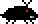
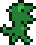

# Navigation Structure
{: .no_toc }

## Table of contents
{: .no_toc .text-delta }

1. TOC
{:toc}

---

# Enemies

## What is an enemy?

An enemy (represented by the `Enemy` class in the `Scene` package) is a `MapEntity` subclass. Enemies in a platformer game
serve to hinder the player from completing a level. For example, in Mario games, enemies like goombas and koopas can kill Mario
if Mario intersects with them in a certain way.
 
The `Enemy` class adds a `touchedPlayer` method that any `Enemy` subclass can override. 
An enemy can be given its own animation and graphics information,
as well as its own `update` cycle which defines its behavior. There really isn't any limit to what an enemy can be made to do,
it's just up to the implementer's coding skills!

As of right now, the `Enemy` classes base `touchedPlayer` method will hurt the player (which in turn kills the player) if the player
touches the enemy. If this behavior is not desired, you can remove that line of code, or override the `touchedPlayer` method
in an enemy class and include logic to determine if the enemy should be hurt or not.

Most enemies adhere to similar collision detection to the player, and can follow those collision rules using the `GameObject` class's
collision methods just like the player does. More details on collision detection and handling can be found [here]().

## Enemy Subclass

In the `Enemies` package, there are currently three subclasses of the `Enemy` class -- `BugEnemy`, `DinosaurEnemy`, and `Fireball`.
Each one of these classes defines an enemy in the game, which can be seen in the game's one level.

Enemies can also set a few attributes such as:
- **isRespawnable** -- if the enemy respawns when it becomes inactive and then active again or not; if set to false, the enemy will be "left in place" next time it becomes active
- **isUpdateOffScreen** -- if the enemy should be updated even when it would not be technically considered "active" by the camera

## Adding a new enemy to the game

This is simple -- create a new class in the `Enemies` package, subclass the `Enemy` class, and then just implement
desired logic from there. I recommend copying an existing enemy class as a "template" of sorts to help set up and design the enemy.

## Adding an enemy to a map

In a map subclass's `loadEnemies` method, enemies can be defined and added to the map's enemy list. For example, in `TestMap`,
a `BugEnemy` and `DinosaurEnemy` are created and added to the enemy list:

```java
@Override
public ArrayList<Enemy> loadEnemies() {
    ArrayList<Enemy> enemies = new ArrayList<>();
    enemies.add(new BugEnemy(getPositionByTileIndex(15, 9), this, Direction.LEFT));
    enemies.add(new DinosaurEnemy(getPositionByTileIndex(19, 1).addY(2), getPositionByTileIndex(22, 1).addY(2), this, Direction.RIGHT));
    return enemies;
}
```

## Enemies currently in game

### Bug Enemy



This enemy is defined by the `BugEnemy` class. I tried to replicate a typical goomba's movement patterns from Mario. Essentially,
the bug enemy will continually walk forward. If it hits a wall, it will turn around. If it walks off the edge of a cliff, it will
fall down until it touches the ground again before it starts walking forward again.

The image file for the bug enemy is `BugEnemy.png`.

### Dinosaur Enemy



This enemy is defnied by the `DinosaurEnemy` class. It will walk back and forth between two specific points. Every few seconds,
it will stop, turn red, and shoot out a fireball.


This enemy is good to reference to see how to have an enemy create another enemy (the dinosaur enemy in this case
creates a fireball enemy and adds it to the map):

```java
// determine fireball starting x location (relative to dinosaur enemy's current location), speed and direction
// based on the direction the dinosaur is facing, the fireball's direction is chosen (either right or left)
int fireballX;
float movementSpeed;
if (facingDirection == Direction.RIGHT) {
    fireballX = Math.round(getX()) + getScaledWidth();
    movementSpeed = 1.5f;
} else {
    fireballX = Math.round(getX());
    movementSpeed = -1.5f;
}

// determine fireball starting y location (relative to dinosaur enemy's current location))
int fireballY = Math.round(getY()) + 4;

// create fireball enemy
Fireball fireball = new Fireball(new Point(fireballX, fireballY), movementSpeed, 1000, map);

// add the fireball enemy to the map's enemy list
map.getEnemies().add(fireball);
```

The image file for the dinosaur enemy is `DinosaurEnemy.png`.

### Fireball


As mentioned in the previous [dinosaur enemy](#dinosaur-enemy) section, the dinosaur enemy will shoot out a fireball every so often.
The fireball will travel straight for a few seconds before disappearing (it will also disappear if it hits a solid tile).
Notice that this enemy sets itself to `REMOVED` when it should disappear -- a map entity with a `REMOVED` status will be permanently
removed from the map enemies list and will not ever respawn.

```java
if (existenceTimer.isTimeUp()) {
    this.mapEntityStatus = MapEntityStatus.REMOVED;
}
```

The image file for the fireball is `Fireball.png`.
