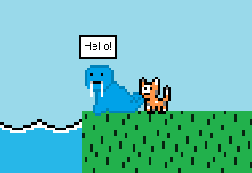

# Navigation Structure
{: .no_toc }

## Table of contents
{: .no_toc .text-delta }

1. TOC
{:toc}

---

# Sprite Font

## What is a sprite font?

A sprite font is what it sounds like -- a "sprite" (graphic) of a font (like Times New Roman, Arial, etc). The `SpriteFont`
class in the `SpriteFont` package allows for easily creating and customizing a sprite font that can be displayed on screen. An example of sprite fonts in action
are on the menu screen -- both the "PLAY GAME" and "CREDITS" menu options are separate `SpriteFont` classes defined in the `MenuScreen` class:


## SpriteFont class

The `SpriteFont` class has already created `draw` logic that will properly draw any sprite font as desired. The following
values must be defined at instantiation time (calling the constructor):

- **text** -- the text of the sprite font
- **x** -- the x location on screen of the sprite font
- **y** -- the y location on screen of the sprite font
- **fontName** -- the name of the font to use, such as "Times New Roman", "Arial", etc.; any font on the computer running this game will work here
- **fontSize** -- size of font (the larger the number, the larger the sprite font text will be)
- **color** -- color of the text

Additionally, there are a couple other values that can be set after instantiation with the appropriate setter method:

- **setFontStyle**-- using Java's built in `Font` enum, you can set the sprite font to have a style such as bold or italic; you would do so like this: `setFontStyle(Font.BOLD);` 
- **setOutlineColor** -- when this is set, the sprite font will be drawn with an outline around it with the chosen color
- **setOutlineThickness** -- the thickness of the outline drawn around the sprite font (will only take effect if outline color has also been set)

The `SpriteFont` class is used all across the application, from the menus to various game objects.

Below is the code for creating the "PLAY GAME" sprite font for the `MenuScreen`:

```java
SpriteFont playGame = new SpriteFont("PLAY GAME", 200, 150, "Comic Sans", 30, new Color(49, 207, 240));
playGame.setOutlineColor(Color.black);
playGame.setOutlineThickness(3);
```

Pretty easy to use! Don't forget to add it to the `draw` cycle:

```java
playGame.draw();
```

## Using sprite fonts in game objects

Using a `SpriteFont` inside a `GameObject` to have the sprite font text show on the map works just like normal, simply
set up the sprite font and add it to the game object's `draw` cycle. One thing to look out for is that a `SpriteFont` will not automatically
calibrate its draw location based on the map's camera unlike a `GameObject` does, since `GameObjects` had extra logic added for that. To
resolve this issue, just be sure to update the `SpriteFont's` location relative to the `GameObject's` location. This is done in the NPC `Walrus` class
to create its speech bubble when taking to it:



The draw method for the `Walrus` will make sure the "Hello!" sprite font message (variable name is `message` is always drawn
at a location relative to the walrus's so it follows map camera draw logic:

```java
message.setLocation(getCalibratedXLocation() + 2, getCalibratedYLocation() - 8);
message.draw(graphicsHandler);
```

Each draw cycle, the location of `message` is set to the calibrated location of the `Walrus` class (read more about the "calibrated" methods [here](/GameDetails/GameObject#gameobject-class)). This
ensures its location stays relative to the walrus's. It also adds 2 to the walrus's x location and subracts 8 from the walrus's y location
to better position itself (this is what leads to the speech bubble being set inside the rectangle which is above the walrus's head).

