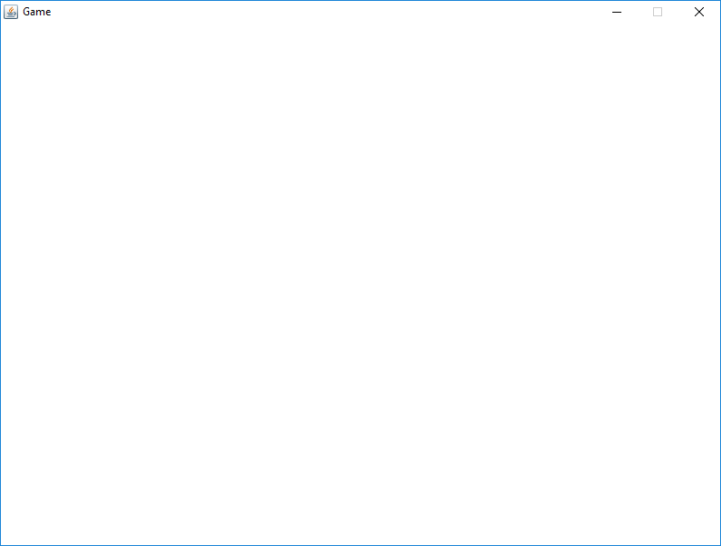

# Navigation Structure
{: .no_toc }

## Table of contents
{: .no_toc .text-delta }

1. TOC
{:toc}

---

# GUI Components

## Java Swing Library

This game uses components from Java's Swing library for its GUI (graphic user interface). All that's really used
is a JFrame for the application window and a JPanel inside the JFrame which is where graphics are "painted" on to.

## Game Window

The `GameWindow` class in the `Engine` package extends the Java Swing `JFrame` class and just sets up the application window
as needed. Otherwise, it's pretty uneventful. This JFrame does hold the all-important `GamePanel` class, but otherwise
it's only job is just to exist.

Essentially, this is all the `GameWindow` brings up on its own:

## Game Panel

The `GamePanel` class in the `Engine` package extends the Java Swing `JPanel` class and is responsible for rendering the game's graphics.
Additionally (although in retrospect this wasn't a great design decision), the `GamePanel` class also sets up various other
essential game resources like the `graphicsHandler` and the Java Swing `Timer` that runs the game loop.

The `GamePanel` class is also home to the universal pause function (which is another poor design decision to include in this class). Pressing the `P`
key at any point while the game is running will immediately stop the game loop's `update` cycle but will continue the game's `draw` cycle,
which essentially "pauses" the game. It will also show the text "PAUSE" in the middle of the screen while the game is paused. The `pauseLabel` variable
is what defines that "PAUSE" text, and the `update` method and `draw` method contain the pause logic.

While the `GamePanel` appears to be doing a lot, at the end of the day it's just a `JPanel` that's doing far more work
than it should be doing. Classic case of a bloated class.

Every `draw` cycle, the `JPanel's` `repaint` method is called, which schedules a re-painting of all graphics to the `JPanel`. As mentioned in
the [game loop](./game-loop.md) documents, this act of "scheduling" a repaint does not immediately execute the re-painting -- the `JPanel` will
carry it out when it's ready to -- this call to `repaint` is asynchronous, meaning Java will carry out the task for painting in a separate thread
from the one currently running the rest of the application. This is not something you have to worry aabout as long as you follow what is said
in the *game-loop* documentation and do not include any game logic during the game loop's `draw` cycle.
