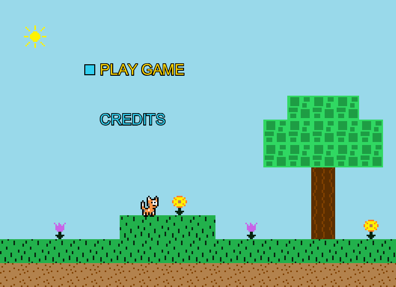

# Navigation Structure
{: .no_toc }

## Table of contents
{: .no_toc .text-delta }

1. TOC
{:toc}

---

# Screens

## What are screens?

This engine is designed to have individual "pieces" of the game to be broken down into separate classes known as `Screens`,
which encapsulate a smaller unit of the game. The game currently has screens such as a Menu Screen, a Credits Screen, and a Play Level Screen.
For a class to be considered a `Screen`, it needs to extend from the engine's `Screen` class and implement its `initialize`, `update`, and `draw` methods.

Screens are just a means to break up the game into logical pieces rather than having everything in one file. A screen is also free
to display other screens, and a screen doesn't have to take up the entire paint-able space of the JPanel. These `Screen` classes also act as
"coordinators" to determine which graphics should be displayed at which time.

For example, the `MenuScreen` class implemented in the game is responsible for handling everything has to do with the main menu
(the menu that shows up upon starting the game), which includes detecting when the player selects an option and routing them to the
proper location in the game based on the option selected as well as drawing any graphics it needs to (such as the background map tiles and the menu option text):

