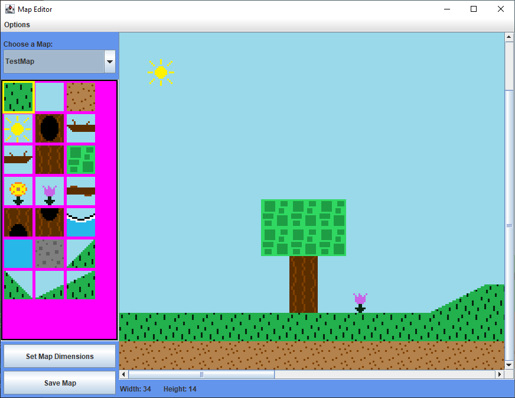
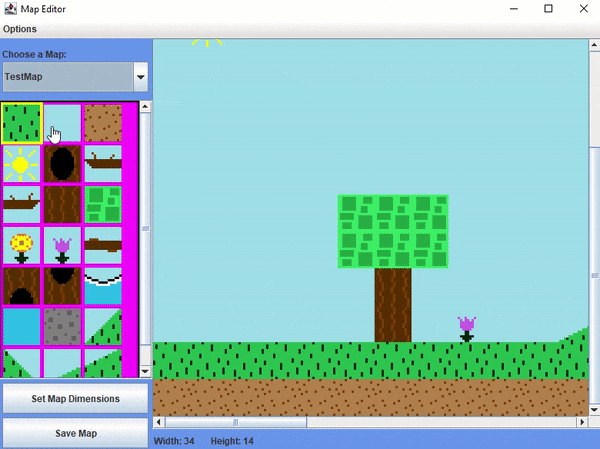

# Navigation Structure
{: .no_toc }

## Table of contents
{: .no_toc .text-delta }

1. TOC
{:toc}

---

# Map Editor

## What is a map editor?

In this project, there is another "sub" project called the Map Editor (all located in the `MapEditor` package) that will load up
a GUI for designing game [tile maps](/GameDetails/Map/MapTilesAndTilesets) with a visual display instead of having to do so through
code and not being able to see the map that is being built. Nearly every video game uses a map editor (level editor, level maker, etc.)
that game developers use to design the game's maps. Games like [Mario Maker](https://www.youtube.com/watch?v=tZ5g5n-6OFg) are literally
just one big map editor (a REALLY good one).

## This game's map editor

The inspiration behind the design of the map editor for this game engine came from the old CD-ROM game [Speedy Eggbert](https://en.wikipedia.org/wiki/Speedy_Eggbert),
which was a staple of my childhood. It was a standard platformer game (with some VERY odd design choices), but the level editor it included with it
was the same one used by the game developers to actually make the game -- it was so fun as a child to be able to make levels
for a game I really liked with ease.

While this game's map editor is limited compared to other commercial map editors for other video games you may have seen/used
(it is only for placing map tiles -- things like enemies must be created and added through code), it is still very useful for designing
a map and being able to see what you are doing as you go.

To run this game's map editor, the `main` method in the `MapEditor` class must be run. Remember this is a separate program
from the actual game code, although both make use of the same classes in this project. You can have both the map editor and the game
running at the same time.

## Map Editor features

This Map Editor allows you to do the following:

- Add a new Map to the game
- Change the individual tiles of a map (which maintain their tile logic defined in code)
- Change the dimensions of a map (how many tiles the map contains width and height wise)



## How to use the map editor

It should be pretty self-explanatory how to use the map editor after playing around with it for 5 minutes. 

On the left-hand sidebar are the tiles that can be used for the map. Since each `Map` subclass (such as `TestMap`) must define
its own `Tileset` (such as `CommonTileset`) (if this doesn't make sense to you, you can read more about the `Map` class [here](/GameDetails/Map) and 
about map tiles and tilesets [here](/GameDetails/Map/MapTilesAndTilesets)). From here, any tile on the left-hand sidebar can be clicked to "select" it
(you will know it has been selected when the tile is highlighted with a yellow box). Afterwards, going to the map and clicking will
replace whichever tile was hovered by the mouse with the selected tile. Below is a gif of this process.



The map being edited can be changed using the dropdown on the top left. To save any changes to a map, hit the "Save Map"
button. The "Set Map Dimensions" button will allow you to change the size of the map (number of tiles width and height). It'll also
allow you to choose which side of the map to apply changes to when growing/shrinking a map's dimensions -- for example, if increasing
the width of the map, more tile space can be added either to the right side or the left of the map.

## Adding a new map to the map editor

Adding a new map to the map editor (and essentially creating a new map entirely) is a relatively easy process.

First start by creating a new class in the `Maps` package that extends the `Map` class. You can look at `TestMap` as a reference for how to do this.
Then for now, all that's needed is a constructor to define the map file name, tileset, and player starting position. An example is below:

```java
public class MyMap extends Map {
    public MyMap() {
        super("my_map.txt", new CommonTileset(), new Point(1, 11));
    }
}
```

In the above example, the map's file will be named "my_map.txt" (which has not been created yet -- the Map Editor will create it for you once its added),
the tilset will use the `CommonTileset` (which can be found in the `Tileset` package), and the player start tile is set to tile index (1, 11). Be sure
that two maps do not share the same map file name, or one will overwrite the other!

Now, in the `MapEditor` package, go to the `EditorMaps.java` file. In here, you will need to add your new map class to these methods.

In `getMapNames`, just add an entry to the list for the name you would want the map to be recognized by -- for example, for this map
I could use "MyMap":

```java
public static ArrayList<String> getMapNames() {
    return new ArrayList<String>() {{
        add("TestMap");
        add("TitleScreen");
        add("MyMap");
    }};
}
```

Then, in the `getMapByName` method, add another switch case for your new map name and return an instance of your new Map class.
For this example, I would add a switch case for "MyMap" (that is the name it was given in the `getMapNames` method) and then
I would return `new MyMap()`:

```java
public static Map getMapByName(String mapName) {
    switch(mapName) {
        case "TestMap":
            return new TestMap();
        case "TitleScreen":
            return new TitleScreenMap();
        case "MyMap":
            return new MyMap();
        default:
            throw new RuntimeException("Unrecognized map name");
    }
}
```

The last thing you have to do is open the Map Editor and in the drop down select your new map. The Map Editor will create a new
blank map file for it. From there, you can change the map dimensions as desired and start designing the map!


